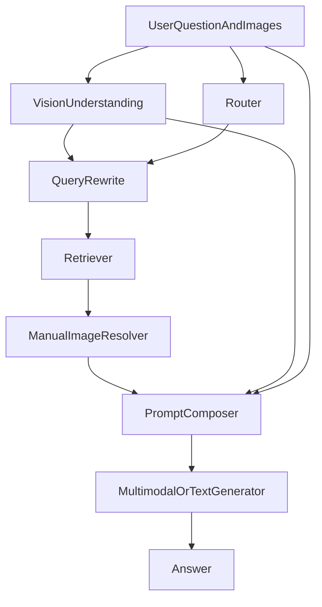

# 多模态客服学习与实现路线

## 你当前最需要先建立的认知

先把一个关键点想清楚：**多模态客服不是“给模型喂图片”这么简单**，而是至少包含 3 条链路：

1. **知识库侧的图文对齐**：手册里的文字与图片怎样对应、建库时怎样保存这种对应关系。
2. **用户输入侧的图文理解**：用户发来的文字 + 图片，怎样被系统联合理解。
3. **检索与回答侧的多模态利用**：系统怎样根据用户图文输入，从知识库里找到更相关的文本/图片证据，并把这些证据用于最终回答。

你当前已经正确意识到了这三个方向，这个思路是对的。

## 你当前代码里的真实状态

### 已经有的基础

- [app/schemas/chat.py](/Users/nikonzhang/compeletion/app/schemas/chat.py) 已支持 `images` 字段，最多 3 张。
- [app/main.py](/Users/nikonzhang/compeletion/app/main.py) 会把 `req.images` 传给 [app/services/pipeline.py](/Users/nikonzhang/compeletion/app/services/pipeline.py)。
- [app/services/ingestion.py](/Users/nikonzhang/compeletion/app/services/ingestion.py) 已支持手册正文中的 `<PIC>` 与 `image_ids` 顺序绑定。
- [scripts/build_index.py](/Users/nikonzhang/compeletion/scripts/build_index.py) 会把每个 chunk 的 `image_ids` 写进 Milvus。
- [app/services/retriever.py](/Users/nikonzhang/compeletion/app/services/retriever.py) 可以把 `image_ids` 带回检索结果。

### 当前最大的缺口

- **用户上传图片完全没有参与推理**：在 [app/services/pipeline.py](/Users/nikonzhang/compeletion/app/services/pipeline.py) 里 `images` 只是保留参数，没有真正进入路由、检索或生成。
- **知识库图片只有 ID，没有像素信息**：目前 [app/utils/prompt_builder.py](/Users/nikonzhang/compeletion/app/utils/prompt_builder.py) 只是把 `图片ID:` 作为字符串喂给模型，模型看不到图像本身。
- **检索仍然是纯文本检索**：Milvus 里只有文本向量和可选 BM25，没有图片向量或跨模态向量。
- **生成仍然是文本模型调用**：当前 [app/services/generator.py](/Users/nikonzhang/compeletion/app/services/generator.py) 只把字符串 prompt 发给 `ChatOllama`，不是视觉输入。

## 从学习角度，建议你按这 4 个层级来学

### 第一层：先理解“多模态到底解决什么问题”

这一步只要建立系统观，不急着写代码。

你要明确多模态客服通常解决以下问题：

- 用户拍了故障灯、零件、标签、界面截图，**文字说不清**，必须看图才能判断。
- 手册中的图片对文字有补充作用，比如部件位置、表带尺寸、指示灯图例。
- 用户问题是“这张图里这个地方是什么意思”“这个灯闪烁代表什么”，本质上是**图文联合理解**。

### 第二层：理解图文对齐的几种实现方式

在你的项目里，建库时图文对齐是第一关键。

当前你已经有一种轻量级方案：

- 手册正文中出现 `<PIC>`
- 对应一个 `image_ids` 列表
- 切 chunk 时把 chunk 内相关图片 ID 挂到该 chunk 上

这属于：**文本 chunk 与图片引用 ID 对齐**。

从学习角度，你可以理解成 3 档：

1. **最轻量**：只存 `image_id`，回答时告诉模型“这个片段对应哪些图片”。
2. **中等方案**：把 `image_id` 进一步映射到图片文件路径/URL，并对图片做 caption（图像说明），caption 作为额外文本证据进入 RAG。
3. **高级方案**：为图片本身建立向量（CLIP / SigLIP 等），实现真正的图片检索与跨模态检索。

对你现在来说，应该先把 **1 → 2** 走通，不要一开始就上 3。

## 你的最佳学习路线（按难度递进）

### 阶段 A：最小多模态可用版（推荐先学先做）

目标：**先让用户图片真正进入推理链**，哪怕还没有多模态检索。

你要学会的能力：

- 什么是视觉模型输入（文本 + base64 图片）
- 如何把视觉模型输出转成一段简短的“图像理解摘要”
- 怎样把这段摘要并入现有文本 RAG 流程

推荐实现思路：

- 在 [app/services/generator.py](/Users/nikonzhang/compeletion/app/services/generator.py) 或新建一个视觉理解模块中，先对用户上传图片生成 **caption / visual note**。
- 在 [app/services/pipeline.py](/Users/nikonzhang/compeletion/app/services/pipeline.py) 中，把这段图像摘要与用户问题拼接，再进入现有 `router -> retrieve -> generate` 流程。

这一步的特点：

- **不改 Milvus schema**
- **不改建库逻辑**
- **先利用用户图片提升理解与路由、检索质量**

这是你最适合的第一步。

### 阶段 B：知识库图片可解释版

目标：让手册检索出来的 `image_ids` 不只是字符串，而是真正能辅助回答。

你要学习的点：

- `image_id -> 图片文件路径/URL` 映射
- 图片 captioning
- 文本证据与图片说明一起作为上下文

推荐实现思路：

- 新增一个图片解析模块，例如把 `image_id` 映射到本地图片文件。
- 在建库或离线预处理时，为每张图片生成一段 caption。
- 检索命中 chunk 后，把对应图片的 caption 一起放入 `context_block`。

这样你仍然是“文本 RAG 主体”，但图片开始真正提供信息，而不是只输出 ID。

### 阶段 C：多模态检索版

目标：让检索不仅看用户文字，也看用户图片。

你要学习的概念：

- 图像向量模型（CLIP / SigLIP 等）
- 跨模态空间（text-image shared embedding）
- 文本检索与图像检索融合（late fusion / score fusion）

推荐实现方向：

- 建库时不只为 `chunk.text` 建向量，也为图片建立向量。
- 用户查询时：
  - 问题文本 → text embedding
  - 用户图片 → image embedding
- 检索时融合：
  - 文本召回结果
  - 图片相似召回结果
  - rerank 融合

这一步复杂度高，建议放在你把阶段 A、B 跑通之后。

### 阶段 D：真正的图文联合回答版

目标：最后生成时，模型能同时看到：

- 用户问题
- 用户图片
- 检索文本证据
- 检索图片证据

这要求你最终的 generator 是一个真正的多模态生成器，而不是单纯 caption + 文本回答。

这一步是上限方案，但不建议你现在就做。

## 从实现角度，最推荐你的分阶段路线

### *Phase 1：用户图片先接入理解链（最优先）*

*这是最有学习价值、也最容易出效果的一步。*

#### *要做什么*

- *在 [app/services/pipeline.py](/Users/nikonzhang/compeletion/app/services/pipeline.py) 中，把* `images` *不再当占位参数。*
- *新增一个轻量视觉理解模块（例如新文件* `app/services/vision.py`*）：输入 Base64 图片列表，输出 1～3 句图像摘要。*
- *将图像摘要作为：*
  - *路由辅助信号*
  - *query rewrite 的补充输入*
  - *生成 prompt 的额外上下文*

#### *为什么先做这个*

*因为它：*

- *不需要大改建库和 Milvus*
- *你能最快学会“多模态消息是怎么传给模型的”*
- *很容易验证是否对理解有帮助*

### Phase 2：把手册图片真正用起来

#### 要做什么

- 保留当前 [app/services/ingestion.py](/Users/nikonzhang/compeletion/app/services/ingestion.py) 的 `<PIC> -> image_ids` 逻辑。
- 新增一个 `image_id -> asset path/url` 的映射层。
- 对映射到的图片做 caption（可离线完成）。
- 在 [app/utils/prompt_builder.py](/Users/nikonzhang/compeletion/app/utils/prompt_builder.py) 中，不只输出 `图片ID:`，而是输出 **图片说明**。

#### 学习重点

- 为什么 caption 是一个很重要的“中间层”
- 为什么 caption 让你不需要立刻做图片向量检索，也能先把图像知识接入 RAG

### Phase 3：多模态 query rewrite

#### 要做什么

- 在 [app/services/pipeline.py](/Users/nikonzhang/compeletion/app/services/pipeline.py) 检索前，把用户原问题 + 图像摘要合成为一个更完整的查询。
- 若有多轮记忆，后续也能把历史中的设备名、故障现象补进这个 query。

#### 学习重点

你会理解一个重要事实：
**很多时候，多模态提升不一定来自“多模态检索”，而是来自“多模态改写查询”。**

### Phase 4：跨模态检索（后续上限）

#### 要做什么

- 修改 [app/services/milvus_create.py](/Users/nikonzhang/compeletion/app/services/milvus_create.py) schema，加入 image vector 字段。
- 修改 [scripts/build_index.py](/Users/nikonzhang/compeletion/scripts/build_index.py)，对图片建立向量。
- 修改 [app/services/retriever.py](/Users/nikonzhang/compeletion/app/services/retriever.py)，融合文本检索与图像检索。

#### 不建议现在做的原因

因为这一步：

- 工程改动大
- 学习曲线陡
- 如果你还没做过视觉输入与 captioning，很容易一开始就陷入复杂系统调试

## 你应该如何理解“正确的多模态客服架构”

这张图里，你现在已经有：

- `router`
- `retrieve`
- `prompt`
- `generator`（但还是文本）

你缺少的是：

- `vision`
- `queryRewrite`（图像感知版）
- `manualImageResolve`
- `generator` 的多模态能力

## 给零基础的学习顺序建议

### 先学什么

1. 什么是多模态输入消息格式（text + image）
2. 什么是图像 caption / image description
3. 什么是 image-text alignment
4. 什么是 cross-modal retrieval（先理解概念，不急着实现）

### 再学什么

1. 什么情况下“caption + text RAG”已经足够
2. 什么情况下必须做“图片向量 + 跨模态检索”
3. 多模态系统里 hallucination 为什么更容易发生，以及为什么需要 evidence gating

## 针对你当前项目，最推荐的第一步实现包

如果你现在要正式开始做多模态，我最建议你按这个顺序：

1. **用户图片 caption 化**：先让用户上传图片进入模型理解
2. **caption 参与 query rewrite**：提升路由与检索质量
3. **手册图片 caption 化**：让检索证据不再只是 `image_id`
4. **最后再考虑图片向量检索**

## 对应到你当前代码的落点

### 当前无需改 schema 就能先做的文件

- [app/services/pipeline.py](/Users/nikonzhang/compeletion/app/services/pipeline.py)
- [app/services/generator.py](/Users/nikonzhang/compeletion/app/services/generator.py)
- [app/utils/prompts/context.py](/Users/nikonzhang/compeletion/app/utils/prompts/context.py)
- [app/utils/prompts/builders/rag_manual.py](/Users/nikonzhang/compeletion/app/utils/prompts/builders/rag_manual.py)

### 第二阶段才建议动的文件

- [app/services/ingestion.py](/Users/nikonzhang/compeletion/app/services/ingestion.py)
- [scripts/build_index.py](/Users/nikonzhang/compeletion/scripts/build_index.py)
- [app/services/milvus_create.py](/Users/nikonzhang/compeletion/app/services/milvus_create.py)
- [app/services/retriever.py](/Users/nikonzhang/compeletion/app/services/retriever.py)

## 最后给你的核心建议

对你当前阶段来说，**最重要的不是一开始就做复杂的多模态检索**，而是先完成下面这句话：

**让用户图片真正进入系统理解，并让手册图片从“ID 字符串”升级成“模型可读的图像信息”。**

只要你先把这两件事做通，你对多模态客服的理解就会迅速建立起来，后续再上图片向量检索会顺很多。