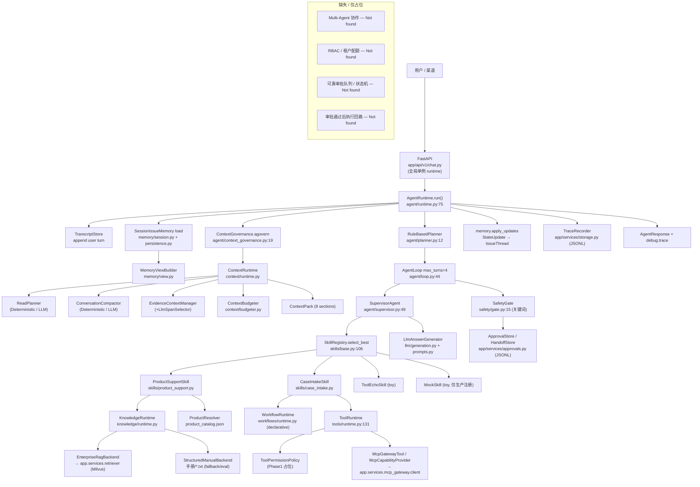

# nikon0 架构审计报告（01）

> 审计对象：`nikon0/` 自研企业产品服务 Agent 框架
> 审计方式：基于真实源码阅读（非文档、非臆测）。所有关键判断附带 `path:line` 证据。
> 审计日期：2026-06-19
> 审计人视角：资深 AI Agent 系统架构师 / 企业客服系统工程师 / 代码审计员

---

## 1. Executive Summary

### 1.1 是否形成最小可运行闭环？

**是。** 系统存在一条端到端、可运行、有 trace 的闭环：

```
HTTP → AgentRuntime → ContextGovernance → Planner → AgentLoop → Supervisor → SkillRegistry → Skill → ToolRuntime → SafetyGate → Memory/Trace 持久化 → AgentResponse
```

证据：
- HTTP 入口 `nikon0/app/api/v1/chat.py:33-44`
- 单轮编排主函数 `nikon0/agent/runtime.py:75-231`（`AgentRuntime.run`）
- 循环 `nikon0/agent/loop.py:44-127`
- 技能选择 `nikon0/skills/base.py:106-186`（`select_best`）
- 工具执行 `nikon0/tools/runtime.py:154-252`（`ToolRuntime.call`）
- 安全闸 `nikon0/safety/gate.py:15-78`

闭环不是 demo 级拼接：它有结构化 `ExecutionTrace`（`nikon0/app/schemas/trace.py:18-33`），有可选 Redis+MySQL 持久化（`nikon0/memory/persistence.py:148-235`），有真实 RAG 适配（`nikon0/knowledge/runtime.py:98-198`），有 150 条 golden case 评测（`nikon0/eval/run_agent_eval.py`）。

### 1.2 当前更像什么阶段？

**分级结论：`MVP`（偏强的 MVP，局部已达 Production Candidate，整体未到）。**

理由：
- **达到 MVP 的部分**：product_support（RAG 问答）、case_intake（工单收集）两条主业务链路真实跑通，有结构化记忆、context pack、trace、eval，且 product_support 在企业 RAG 上 `enterprise_rag_ok_rate=1.0`（`nikon0/eval/reports/agent-eval-full-150/metrics.md:13`）。
- **拉低到 MVP 而非 Production 的部分**：
  - 权限/审批/安全闸大量是关键词匹配 + Phase1 占位策略（`nikon0/safety/gate.py:18-19`、`nikon0/tools/runtime.py:112-128`）。
  - 多 Agent 协作 **Not implemented**，只有一个 `SupervisorAgent`（`nikon0/agent/runtime.py:61-63`）。
  - HITL approval/handoff 存储是 JSONL 文件回放（`nikon0/app/services/approvals.py:62-119`），不是可靠队列。
  - Planner 是硬编码中文关键词（`nikon0/agent/planner.py:22-79`）。
  - 全量 eval 通过率 49.3%（`nikon0/eval/reports/agent-eval-full-150/metrics.md:4`），boundary 8%、handoff 20%，说明边界与人工流远未稳定。

### 1.3 最大的 3 个架构风险

1. **Safety / Permission 是关键词驱动的占位实现，不能上生产。**
   退款/赔偿/转人工等高风险判定靠 `message` 子串匹配（`nikon0/safety/gate.py:18-19`、`41`）。绕过（同义词、错别字、语义改写）即失效；同时 `ToolPermissionPolicy` 对 `requires_approval`/`high` 一律硬阻断（`nikon0/tools/runtime.py:115-128`），没有角色、租户、配额、审批回填执行的闭环。

2. **HITL（审批/转人工）没有可靠的工单状态机与持久队列。**
   approval/handoff 仅写 JSONL 并全量读回内存（`nikon0/app/services/approvals.py:62-119`），无幂等、无并发锁、无状态流转（approved 之后没有"继续执行被批准动作"的回路）。生产多副本部署会数据竞争 / 丢失。

3. **生产 runtime 与 eval runtime 不一致，且生产默认仍挂 `MockSkill`。**
   生产 `_build_default_skills` 注册了 `MockSkill`（`nikon0/agent/runtime.py:353-362`），eval runtime 不挂（`nikon0/eval/run_agent_eval.py:215`）。生产启用全套 LLM context 组件（`nikon0/agent/runtime.py:284-323`），eval 默认 deterministic。**评测结果不能代表生产行为**——这是审计中最危险的工程问题：你拿来做决策的 49.3% 与线上跑的不是同一套配置。

### 1.4 最值得保留的 3 个设计亮点

1. **Trace 作为一等公民贯穿全链路。** `ExecutionTrace` 在 runtime 起点创建（`nikon0/agent/runtime.py:76-80`），skill/tool/knowledge/safety/memory 每一步都 `add_event`，并整体进 `AgentResponse.debug`（`nikon0/agent/runtime.py:217-230`）。这是可观测性与可评测性的根基，质量明显高于一般 demo。

2. **Context Pack 治理层（分 section + 预算降级 + 证据不摘要）。** `ContextRuntime` 把上下文拆成 8 个命名 section，按优先级预算降级（`nikon0/context/runtime.py:17-127`、`nikon0/context/budgeter.py:26-56`），证据默认保留 raw excerpt 不做有损摘要（`nikon0/context/evidence.py:1-7`）。这是工业级思路，远超"字符串拼 prompt"。

3. **能力注册表 + 不可变快照 + 多源 skill 选择融合。** `SkillRegistry.select_best` 融合 sticky → model(LLM) → planner → rule_fallback，并对缺失 required_tools 做选择级拒绝（`nikon0/skills/base.py:106-186`、`337-374`）。这套优先级 + 校验是真正可扩展的路由骨架。

---

## 2. Architecture Map



模块存在性结论：

| 模块 | 状态 |
| --- | --- |
| User / API entry | ✅ 存在（单例 runtime，见 §3.13 风险） |
| Agent Runtime / Loop | ✅ 存在 |
| Skill | ✅ 存在（2 真实 + 2 toy） |
| Tool | ✅ 存在 |
| Workflow / Protocol | ✅ 存在（declarative，简单） |
| RAG | ✅ 存在（真实适配 + 本地 fallback） |
| Memory / State | ✅ 存在（结构化 + 可持久化） |
| Context / Prompt | ✅ 存在（最完整的模块） |
| Trace | ✅ 存在 |
| Eval | ✅ 存在 |
| MCP | ✅ 存在（依赖父项目 client） |
| Storage | ⚠️ 部分（Memory 有 SQL；trace/approval 仅 JSONL） |
| Multi-Agent 协作 | ❌ `planned only` |
| RBAC / 权限模型 | ❌ `Not found in current codebase` |
| 审批执行回路 | ❌ `Not found in current codebase` |

---

## 3. Module-by-module Review

### 3.1 Agent Runtime / Loop

**当前实现**：`AgentRuntime.run`（`nikon0/agent/runtime.py:75-231`）串起 transcript→memory→context(`agovern`)→planner→loop→safety→持久化→response。`AgentLoop`（`nikon0/agent/loop.py:44-127`）做最多 4 轮 plan/act：agent 产出 `tool_calls` 就执行工具并继续，否则停止。

**关键代码**：
- `nikon0/agent/runtime.py:104`（`await self.context_governance.agovern`）
- `nikon0/agent/loop.py:71`（`last_result = await agent.run(context)`）
- `nikon0/agent/loop.py:90-100`（工具执行 + retry）

**亮点**：依赖全部可注入（`runtime.py:42-57`），可测性极好；loop 有 `max_turns` 硬上限防死循环；retry 有 trace（`loop.py:92-100`）。

**不足**：
- `run()` 单函数 ~150 行，承担过多职责（trace/transcript/memory/answer 降级混在一起）。
- Loop 终止条件单一（仅"无 tool_calls"或 max_turns），无"证据足够""工具已成功"等语义终止。
- 工具调用串行执行（`loop.py:90`），无并发、无去重。
- Loop 内多轮之间 **不会重新 govern context**；只有 ProductSupportSkill 内部检索后手动再 govern 一次（`skills/product_support.py:209-211`），属特例补丁而非框架能力。

**toy/placeholder 风险**：低。这是真实实现。

**能否上真实环境**：可作为单 Agent 编排骨架上线，但需先拆函数、补 loop 终止策略。

**需补齐**：answer 组装独立模块、loop policy、turn 间 re-govern。

---

### 3.2 Skill Layer

**当前实现**：`Skill` Protocol（`nikon0/skills/base.py:20-30`）+ `SkillRegistry.select_best`（`base.py:106-186`）多源融合：sticky → model → planner → rule_fallback，并在选中后校验 required_tools（`base.py:337-374`）。Supervisor 按 skill 设阈值（product_support 0.55，默认 0.75，`agent/supervisor.py:14-19`）。

**已注册 skill**：
- ProductSupportSkill（真实，RAG）
- CaseIntakeSkill（真实，工单）
- ToolEchoSkill（**toy**，验证工具回路）
- MockSkill（**toy**，仅生产 runtime 注册：`runtime.py:361`）

**亮点**：选择来源带 `source` 标签全程可追溯；sticky policy 有 `max_turns` 防过度粘滞（`base.py:296-305`）；缺工具会"选择级拒绝"而非运行时报错（`base.py:347-367`）。

**不足**：
- rule_fallback 的 `can_handle` 是关键词/状态匹配（`product_support.py:88-109`、`case_intake.py:126-158`），语义鲁棒性弱。
- 复合意图无真正编排：planner 能识别 `is_composite`（`planner.py:93`），但 loop 只跑单个被选中的 skill。

**toy/placeholder 风险**：`ToolEchoSkill`/`MockSkill` 是 toy；**生产注册 MockSkill 必须移除**（见 §1.3 风险 3）。

**能否上真实环境**：两个真实 skill 可上；必须先剔除 MockSkill 并对齐 eval。

**需补齐**：复合意图编排、语义路由稳健性、移除 toy skill。

---

### 3.3 Tool Layer

**当前实现**：`ToolRegistry`（快照）+ `ToolPermissionPolicy` + `HookRunner`（pre/post/failure 审计 hook）+ `ToolRuntime.call`（`nikon0/tools/runtime.py:93-252`）。`call_step` 会把结果追加到 `context.tool_results`（`runtime.py:148-152`）。工具默认集 `default_tools()`（`runtime.py:275-344`）含 echo、product、case-intake、memory、MCP 工具。

**关键代码**：
- 权限策略 `nikon0/tools/runtime.py:112-128`
- 调用生命周期 `nikon0/tools/runtime.py:154-252`
- 审批请求构造 `nikon0/tools/runtime.py:166-178`

**亮点**：完整 pre/permission/call/post/failure 生命周期 + 全程 trace（`runtime.py:155-251`）；工具异常被捕获并转成结构化 `ToolCallResult`（`runtime.py:220-232`）；MCP 失败有静态 fallback 注册（`runtime.py:312-337`）。

**不足 / placeholder**：
- `_audit_pre_tool` 永远返回 allowed（`runtime.py:75-80`）——hook 框架在、但**实际权限审计是空壳**。
- `ToolPermissionPolicy.check` 是 Phase1 占位：`requires_approval`/`high` 一律阻断，注释明说 "approval flow is not enabled yet"（`runtime.py:115-128`）。没有 role/tenant/quota/scope。
- 工具调用无去重、无超时（超时只在 MCP 层 spec 里有 `x-timeout-ms` 元数据，runtime 不强制执行）。

**能否上真实环境**：生命周期骨架可上；**权限模型不可上生产**。

**需补齐**：真实 permission（RBAC/租户/scope）、审批通过后的执行回路、tool 超时强制。

---

### 3.4 Workflow / Protocol Layer

**当前实现**：`WorkflowProtocol` / `WorkflowDecision` / `WorkflowRuntime`（`nikon0/workflows/runtime.py`）。`decide` 按 intent 选协议，并对 message 关键词做投诉/退款覆盖（`runtime.py:43-65`）。默认 4 个协议：repair/refund/complaint/cancel（`runtime.py:88-127`）。

**亮点**：声明式 protocol（required_slots / approval_required / handoff_required / next_tool / stop_when），把"风险与必填字段"前置到配置（`runtime.py:91-118`）。

**不足**：
- 路由仍是关键词（`runtime.py:59-64`），与 SafetyGate/Planner 的关键词三处重复，易漂移。
- `missing_slots` 仅判断字段非空（`runtime.py:69-73`），无格式校验（如电话号、订单号正则）。
- 协议是硬编码函数返回，非外部配置（`runtime.py:88-127`），无法热更新/租户差异化。

**toy 风险**：中。逻辑真实但过简。

**能否上真实环境**：可作为 v1 流程骨架；字段校验与配置化需补。

---

### 3.5 RAG / Product Support

**当前实现**：`ProductSupportSkill.run`（`nikon0/skills/product_support.py:111-262`）：resolve_product → search_product_manual → (检索后再 govern) → LLM 生成 → validate_answer_grounding。RAG 经 `EnterpriseRagBackend`（`knowledge/runtime.py:98-198`）适配父项目 `app.services.retriever.VectorRetriever`（`runtime.py:205-209`），失败 fallback 到本地 `StructuredManualBackend`（`runtime.py:119-134`）。

**亮点**：
- 真实复用企业 Milvus/BM25/rerank/多模态检索（`runtime.py:136-198`），nikon0 只做治理适配（权限过滤、证据归一、backend trace）。
- 检索后把 evidence 写回 context 并二次 govern（`product_support.py:208-211`），让证据真正进 prompt。
- 有产品消歧（`ProductResolver` + `product_catalog.json`），歧义时返回澄清而非乱答（`product_support.py:176-188`）。
- 有 grounding 校验工具（`tools/product.py:117-163`）。

**不足 / toy**：
- `StructuredManualBackend` 是 toy 级 BM25-ish：token 子串计数打分（`knowledge/runtime.py:354-362`），仅用于 fallback/eval，**不可作为主检索**（代码注释已明示 `runtime.py:24-27`）。
- `ValidateAnswerGroundingTool` 是确定性 token overlap（`tools/product.py:140-163`），注释自承 "conservative first-pass"，**不是真正的 grounding 判定**，`grounded` 只要有任意 overlap 即 true（`product.py:151`）。
- grounding 结果只写 trace，**不阻断**不达标答案（`product_support.py:223-245`），即 RAG 幻觉无硬约束。
- `ProductCatalog` 是手维护 JSON（`product_resolver.py:42-60`），新增产品需改文件。

**能否上真实环境**：主链路（企业 RAG 路径）可上；grounding 校验与 catalog 维护需升级。

---

### 3.6 Ticket / Case Intake

**当前实现**：`CaseIntakeSkill`（`nikon0/skills/case_intake.py`）。流程：`extract_case_slots`（本地工具）→ `WorkflowRuntime.decide` → 产出 `collect_case_intake` 的 `ToolCallRequest` → loop 执行 MCP 工具 → 下一轮消费 tool_result 生成回复与 StateUpdate（`case_intake.py:160-263`）。sticky policy 在 `collecting` 状态粘住（`case_intake.py:100-107`）。

**亮点**：
- 工单收集走 ToolRuntime/MCP，而非 skill 内部直连业务系统（`case_intake.py:175-188`）。
- 状态机清晰：`collecting/waiting_user/submitted/cancelled/diagnosing`（`memory/session.py:222-244`）。
- 有取消意图短路（`case_intake.py:344-346`）。

**不足 / toy**：
- 真正的工单提交工具在 eval 里是 `_EvalCaseIntakeTool`（**deterministic mock**，`eval/run_agent_eval.py:285-312`）。生产依赖父项目 MCP gateway 的 `collect_case_intake`，**本仓库内没有真实工单系统实现**。
- "是否需要用户确认提交"没有显式确认步：completed=true 即视为 submitted（`session.py:231-232`），无 "draft → 用户确认 → submit" 两段式。
- 没有 ticket draft 实体；ticket 仅以 `ticket_payload` dict 存在 thread 上（`session.py:73-83`）。

**能否上真实环境**：收集/状态机可上；**提交需对接真实工单系统并加用户确认**。

---

### 3.7 Memory / State

**当前实现**：正式模型 `SessionIssueMemory / IssueThread / IssueFact / EvidenceRef`（`nikon0/app/schemas/memory.py:16-75`）。写入由 `InMemorySessionIssueStore.apply_updates`（`memory/session.py:28-41`）把 `StateUpdate` 落成 thread/fact/evidence_ref，并维护 active_product/active_skill/状态机。可持久化版 `RedisMysqlSessionIssueStore`（`memory/persistence.py:148-199`）：Redis 热快照 + MySQL 快照 + append-only StateUpdate 事件审计。`MemoryViewBuilder` 产出受预算约束的 model-facing view（`memory/view.py:67-145`）。

**亮点**：
- 真正的结构化记忆（thread/fact/evidence_ref），不是 flat dict。
- 写入即审计：每个 StateUpdate 都生成 `EvidenceRef`（`session.py:64-70`）并在 SQL 落 append-only 事件（`persistence.py:77-94`）——可 replay。
- MemoryView 有 char budget 裁剪（`view.py:133-145`）。

**不足**：
- **谁写状态**：由 skill 产出 `StateUpdate`、runtime 调用 `apply_updates`（`runtime.py:140-144`）。没有 LLM-based extractor，也**没有 StateUpdateCandidate / 冲突检测 / 写入校验**——skill 写什么就存什么。
- `flat_state` 与结构化 thread 双轨并存（`session.py:61` vs 结构化字段），冗余且易不一致。
- 同一 `update.key` 后写覆盖前写（`session.py:217`），无版本/置信度仲裁。

**能否上真实环境**：读/写/持久化骨架可上；**缺写入校验与冲突检测**，这是下一步最该补的（见文档 03）。

---

### 3.8 Context / Prompt Assembly

**当前实现**：本仓库**最成熟**的模块。`ContextRuntime` 组装 8 section（system_policy/workflow/memory/conversation/tool_observations/evidence/current_user/runtime，`context/runtime.py:87-96`），经 `ContextBudgeter` 做 per-section + total 预算降级（`context/budgeter.py:26-56`）。read planner / conversation compactor / evidence span selector 均有 deterministic + LLM 两档（`runtime.py:283-323` 装配）。证据默认不摘要、保留 raw excerpt（`context/evidence.py:1-7`、`44-67`）。

**亮点**：分层、预算、证据保真、可降级、可观测（每步 trace），并有独立 context eval（`eval/context_eval.py`）。LLM 节点失败回退 deterministic（设计文档 `nikon0/docs/engineering_baseline.md:273-290`）。

**不足**：
- prompt 最终拼装在 `llm/prompts.py:97-112`，把整个 `section_map()` 塞进一个 JSON payload 给模型，section 间隔离靠 JSON key，**仍是"混在一个 payload 里"**，不是分角色 message。
- turn 间不自动 re-govern（见 §3.1）。
- LLM context 组件只在生产开启、eval 不开（`runtime.py:284-292` vs `eval/run_agent_eval.py:226-230`），两边行为不一致。

**能否上真实环境**：可，且是亮点；但需对齐 eval 配置。

---

### 3.9 Trace / Logging

**当前实现**：`ExecutionTrace`（`schemas/trace.py:18-33`）含 selected_agents/skills、context_events、knowledge_calls、tool_calls、safety_decisions、memory_updates、events。全链路 `add_event`。落地 `JsonlTraceRecorder`（`app/services/storage.py:37-77`）。

**亮点**：trace 覆盖面广、结构化、可 replay（JSONL）、整体进 response.debug。

**不足**：
- JSONL `get`/`list_for_session` 每次全文件扫描（`storage.py:55-77`），生产规模会退化。
- 无 structlog/OpenTelemetry/metrics 接入（设计文档提到但 **Not found in code**）。
- trace 含完整 section content（`runtime.py:256`），可能含敏感信息，无脱敏。

**能否上真实环境**：调试足够；生产需换 DB/对象存储 + 索引 + 脱敏。

---

### 3.10 Eval

**当前实现**：`run_agent_eval`（`eval/run_agent_eval.py:95-200`）跑 150 golden case，产出 skill/tool/safety/evidence/fact_coverage/rag_backend 等多维指标（`EvalRunReport` `run_agent_eval.py:71-92`）。另有独立 context eval（`eval/context_eval.py`）。报告已落盘（`eval/reports/*/metrics.md`）。

**亮点**：多维度、分类别、有 enterprise_rag_ok / fact_coverage / evidence_alignment 等业务指标；golden case 达 150 条。

**不足**：
- **eval runtime ≠ 生产 runtime**（`build_eval_runtime` `run_agent_eval.py:203-230` 无 MockSkill、无 LLM context、用 `_EvalCaseIntakeTool` mock）。这是评测有效性的根本缺陷。
- 多处指标默认值乐观（`fact_coverage_score: float = 1.0` 默认满分，`run_agent_eval.py:63`），可能掩盖问题。

**能否上真实环境**：作为开发回归可用；**作为生产门禁前必须先对齐 runtime**。

---

### 3.11 MCP

**当前实现**：`McpGatewayTool`（`tools/mcp_gateway.py:10-58`）+ `McpCapabilityProvider`（`mcp/provider.py`）把 MCP 能力适配成 ToolRuntime 工具，依赖父项目 `app.services.mcp_gateway.client.McpGatewayClient`（`tools/runtime.py:295`、`tools/mcp_gateway.py:31-33`）。

**亮点**：外部系统统一经 MCP 入口，nikon0 不直绑业务系统；有 policy（risk_level/approval/tags）与 allowlist（`runtime.py:300-309`）。

**不足 / toy**：
- 真实 MCP client 在父项目，本仓库只有适配层；连接失败静默 `except: pass`（`runtime.py:312-313`）并退到静态注册的占位 `McpGatewayTool`，**运行期才暴露不可用**。
- 无重试/熔断/超时强制（仅 spec 元数据）。

**能否上真实环境**：取决于父项目 MCP gateway 成熟度；适配层 OK，韧性需补。

---

### 3.12 Storage

**当前实现**：
- Memory：In-Memory / Redis+MySQL（`memory/persistence.py`）——**最完整**。
- Trace：In-Memory / JSONL（`app/services/storage.py`）。
- Transcript：In-Memory / JSONL（`storage.py:80-137`）。
- Approval/Handoff：In-Memory / JSONL 回放（`app/services/approvals.py`）。

**不足 / toy**：
- trace/transcript/approval 的"持久化"都是**单文件追加 + 全量读回**（`storage.py:64-77`、`approvals.py:100-119`），无并发安全、无索引、多副本会冲突。
- approval 状态更新只改内存 + 追加事件（`approvals.py:84-88`），无事务。

**能否上真实环境**：Memory 可上；trace/transcript/approval 的 JSONL 版**不可用于多副本生产**。

---

### 3.13 Error Handling

**当前实现**：工具异常→结构化 result（`tools/runtime.py:220-232`）；skill 异常→Supervisor 捕获并按 fallback policy 转 handoff/general（`agent/supervisor.py:88-153`）；RAG 异常→fallback backend（`knowledge/runtime.py:119-134`）；LLM 异常→fallback answer（`llm/generation.py:33-48`）；MCP 导入失败→静态注册（`tools/runtime.py:312-337`）。

**亮点**：分层容错完整，几乎每个外部依赖都有降级。

**不足**：
- 错误不分类（可恢复 vs 不可恢复），retry 只一次且不改参（`loop.py:90-100`）。
- 多处 `except Exception: pass` / 静默回退（`runtime.py:312`），生产会"看起来正常但其实降级了"，缺告警。

**能否上真实环境**：基本可；需补错误分级与降级告警。

---

### 3.14 Permission / Safety / Policy

**当前实现**：`SafetyGate.check`（`safety/gate.py:15-78`）：handoff 关键词 / approval 关键词 / workflow 标志 / result risk → 生成 ApprovalRequest 或 HandoffRequest 并阻断。`ToolPermissionPolicy`（`tools/runtime.py:112-128`）。

**亮点**：高风险默认阻断（fail-closed 倾向）；safety decision 全程 trace（`gate.py:68-77`）；HITL 请求结构化。

**不足 / 严重**：
- 风险判定靠**中文关键词子串**（`gate.py:18-19`）：`("退款","赔偿","修改订单"...)`。语义改写、错别字、外语即绕过。这是**最不可上生产的点**。
- 没有 RBAC、租户隔离、scope、配额（**Not found**）。
- **审批通过后没有执行回路**：approval 被 `approved` 后，系统没有任何代码"继续执行原被阻断动作"（`app/api/v1/chat.py:52-54` 只更新状态）。HITL 是半截子。
- pre_tool 审计 hook 是空壳（`runtime.py:75-80`）。

**能否上真实环境**：**否。** 这是 P0 不可上生产模块之一。

---

## 4. Production Readiness Matrix

| Module | Current Status | Production Risk | Evidence in Code | Must Fix Before Production |
| --- | --- | --- | --- | --- |
| Agent Runtime / Loop | MVP | Medium | `agent/runtime.py:75-231`, `agent/loop.py:44-127` | run() 拆分；loop 终止策略；turn 间 re-govern |
| Skill Layer | MVP | Medium | `skills/base.py:106-186`, `agent/runtime.py:353-362` | 移除生产 MockSkill；复合意图编排 |
| Tool Layer | MVP（权限占位） | High | `tools/runtime.py:75-128` | 真实 permission；pre_tool 审计落地；tool 超时 |
| Workflow / Protocol | MVP | Medium | `workflows/runtime.py:43-127` | slot 格式校验；协议配置化 |
| RAG / Product Support | MVP→Candidate | Medium | `knowledge/runtime.py:98-198`, `skills/product_support.py:111-262` | grounding 硬阻断；catalog 维护机制 |
| Ticket / Case Intake | MVP | High | `skills/case_intake.py:160-263`, `eval/run_agent_eval.py:285-312` | 真实工单提交 + 用户确认两段式 |
| Memory / State | MVP→Candidate | Medium | `memory/session.py:28-99`, `memory/persistence.py:148-199` | StateUpdate 校验 + 冲突检测 |
| Context / Prompt | Candidate | Low | `context/runtime.py:17-127`, `context/budgeter.py:26-56` | 对齐 eval 配置；分角色 message |
| Trace / Logging | MVP | Medium | `schemas/trace.py:18-33`, `app/services/storage.py:37-77` | DB 化 + 索引 + 脱敏；metrics |
| Eval | MVP | High | `eval/run_agent_eval.py:203-230` | eval runtime 对齐生产 runtime |
| MCP | Prototype（依赖父项目） | High | `tools/runtime.py:294-337`, `mcp/provider.py` | 韧性（重试/熔断/超时）；显式健康检查 |
| Storage (trace/approval) | Toy（JSONL） | Critical | `app/services/approvals.py:62-119` | DB 化；并发安全；事务 |
| Error Handling | MVP | Medium | `agent/supervisor.py:88-153`, `knowledge/runtime.py:119-134` | 错误分级；降级告警 |
| Permission / Safety | Toy（关键词） | Critical | `safety/gate.py:18-19`, `tools/runtime.py:115-128` | 真实风险模型 + 审批执行回路 + RBAC |
| Multi-Agent | Planned only | N/A | `agent/runtime.py:61-63` | （非短期必须） |

风险等级：Low / Medium / High / Critical。

---

## 5. Overall Verdict

### 5.1 当前是否基本可用？

**对内 demo / 受控试点：可用。** 主链路真实、可观测、可评测，product_support + case_intake 两条业务线能跑出有意义的结果。

**对真实生产：不可用。** 三个 Critical 拦路：① Safety/Permission 是关键词占位（`safety/gate.py:18-19`）；② trace/approval 存储是 JSONL 不支持多副本（`app/services/approvals.py:62-119`）；③ eval runtime 与生产 runtime 不一致导致评测结论不可信（`eval/run_agent_eval.py:203-230` vs `agent/runtime.py:284-362`）。

### 5.2 如果只能选一个最该改的模块

**Memory / State 的写入治理（StateUpdate 校验 + 冲突检测 + 候选化）。**

> 注：Safety 和 Storage 的风险等级更高（Critical），但它们的根治需要对接真实业务系统（工单、审批执行、RBAC），三天内做不出可信的工业级成品，容易变成又一层占位。而 Memory 写入治理是**纯框架内、当前缺口明确、三天可落地、且能立刻提升所有 skill 的可靠性与可审计性**的杠杆点：它让"谁写了什么、为什么写、是否冲突"变得可控，是后续 Safety/Ticket 可靠化的地基。详细论证见 `03_next_3_day_plan.md`。

### 5.3 三天内最该优先做什么

1. **（半天，必须）对齐 eval runtime 与生产 runtime**：移除生产 MockSkill，让 eval 走与生产相同的 context 配置。否则后续一切优化都在"测假的"。
2. **（2.5 天，主线）Memory 写入治理模块**：`StateUpdateCandidate` + `MemoryWriteValidator` + 冲突检测 + trace + eval。

---

## 附：明确的"Not found in current codebase"清单

- 多 Agent / SpecialistAgent 协作编排（仅单 `SupervisorAgent`）。
- RBAC / 角色 / 租户配额 / scope 权限模型。
- 审批通过后"继续执行被阻断动作"的回路。
- LLM-based memory extractor / StateUpdateCandidate / 写入冲突检测。
- structlog / Prometheus / OpenTelemetry 接入。
- 工单系统真实提交实现（生产依赖父项目 MCP；eval 用 mock 工具）。
- trace / transcript / approval 的数据库存储（仅 In-Memory 与 JSONL）。
