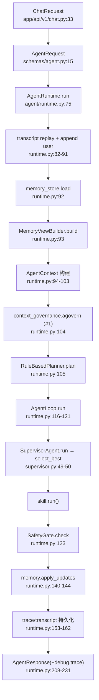
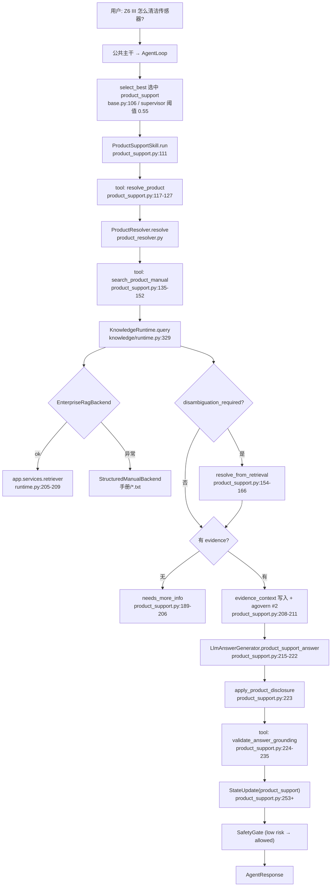
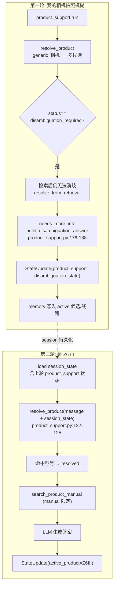
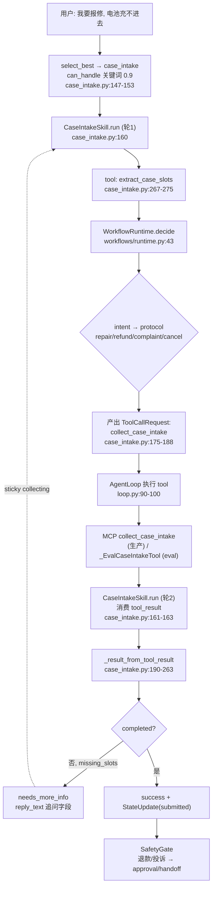
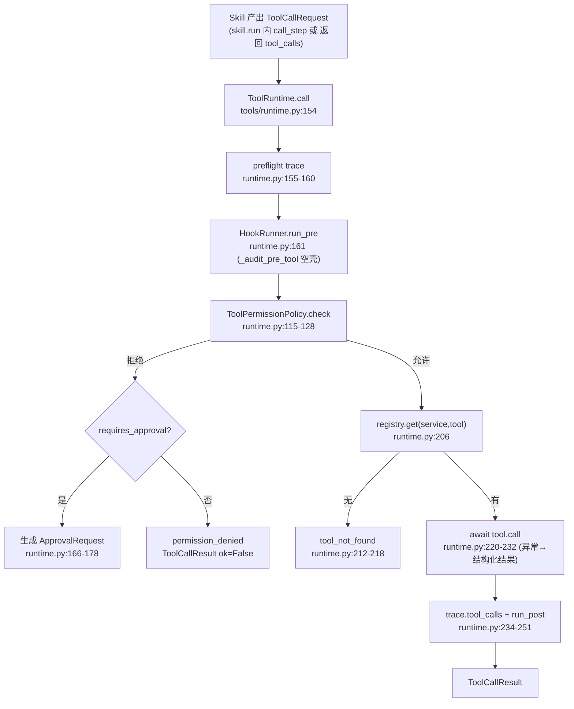
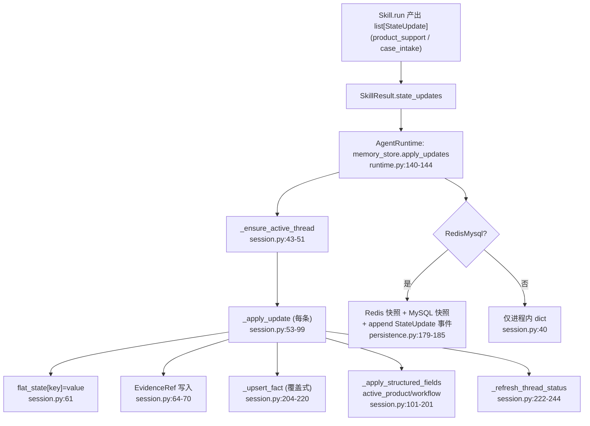
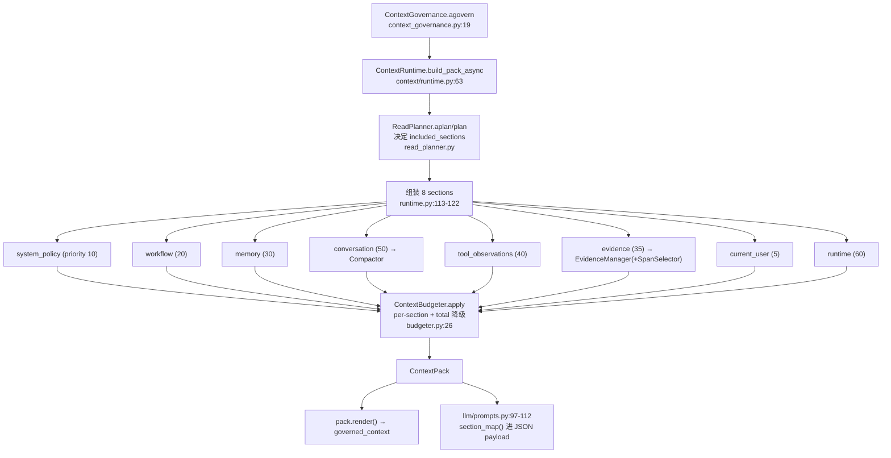
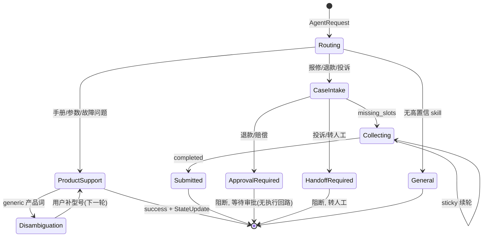

# nikon0 流程详解（02）

> 本文按流程类别逐一拆解 nikon0 的真实执行路径。每个流程含：流程图 → 关键代码跳转 → 数据结构 → 分步解释 → 案例演示 → 缺陷与风险。
> 所有代码位置格式为 `path:line`，可直接跳转。
> 基于源码（非文档）梳理，审计日期 2026-06-19。

---

## 0. 公共主干（所有流程都会走）

在进入具体流程前，所有请求都先走一段公共主干。后续各流程只在"选中哪个 skill / 走哪条分支"上分叉。



**关键跳转**：
- 入口 `nikon0/app/api/v1/chat.py:33-44`
- 主编排 `nikon0/agent/runtime.py:75-231`
- 选择 `nikon0/skills/base.py:106-186`

**核心数据结构**：

```python
# nikon0/app/schemas/agent.py:50-69
class AgentContext(BaseModel):
    request: AgentRequest
    session_state: SessionIssueMemory | None      # 结构化记忆
    memory_context: str                            # MemoryView 渲染文本
    transcript_context: str                        # 历史对话文本
    governed_context: str                          # ContextPack.render()
    context_pack: Any | None                       # ContextPack 对象
    context_governance: Any | None                 # 供 skill 二次 govern
    evidence_context: list[Evidence]               # 检索证据
    selected_skill: str | None
    skill_selection: SkillSelection | None
    plan: PlannerResult | None
    tool_results: list[dict]                        # 本轮所有 tool 结果
    trace: ExecutionTrace                           # 全链路 trace
```

> 注意：`AgentRuntime` 是模块级单例（`app/api/v1/chat.py:13`），但 per-request 状态都在 `AgentContext` 里，store 按 session_id 隔离，故单进程内并发安全；多副本下 JSONL 存储会冲突（见文档 01 §3.12）。

---

## 1. 普通商品服务 RAG 流程

用户问商品使用方法、参数、故障排查等单轮手册问题。

### 1.1 流程图



### 1.2 关键代码跳转

| 步骤 | 位置 |
| --- | --- |
| 选中 skill（rule fallback 0.82） | `nikon0/skills/product_support.py:88-104` |
| resolve_product | `nikon0/skills/product_support.py:117-127` |
| search_product_manual | `nikon0/skills/product_support.py:135-152` |
| 企业 RAG 检索 | `nikon0/knowledge/runtime.py:136-198` |
| 本地 fallback 打分 | `nikon0/knowledge/runtime.py:354-362` |
| 检索后二次 govern | `nikon0/skills/product_support.py:208-211` |
| LLM 生成 | `nikon0/llm/generation.py:17-57`、`nikon0/llm/prompts.py:26-59` |
| grounding 校验 | `nikon0/tools/product.py:140-163` |
| 证据进 prompt（不摘要） | `nikon0/context/evidence.py:44-67` |

### 1.3 数据结构

```python
# nikon0/app/schemas/knowledge.py — KnowledgeRequest / KnowledgeResult
# Evidence: nikon0/knowledge/runtime.py:300-306
Evidence(
    evidence_id="enterprise_rag:{chunk_id}",
    source="enterprise_rag",
    text="...chunk 原文...",
    payload={"chunk_id","manual_name","score","image_evidence",...},
    confidence=min(1.0, max(0.05, score)),
)

# RAG backend_trace（进 trace.knowledge_calls，runtime.py:167-174）
{"backend":"enterprise_rag","ok":True,"collection":...,"raw_count":N,"filtered_count":M,
 "manual_name_decision":{...},"retrieval_trace":{...}}
```

证据进 prompt 的形态由 `EvidencePack`（`context/evidence.py:28-34`）控制：按 confidence 排序、去重、裁剪 raw excerpt、保留 source metadata，**不做自由摘要**。

### 1.4 分步解释

1. **进入系统**：`POST /api/v1/chat` → `AgentRequest` → `AgentRuntime.run`（公共主干）。
2. **选 skill**：`select_best` 依次试 sticky/model/planner/rule_fallback。单轮无 sticky 状态时，LLM selector（若开启）或 planner（`planner.py:37-74`）或 rule_fallback（`product_support.py:97-104`，置信度 0.82）命中 product_support；Supervisor 用 0.55 阈值放行（`supervisor.py:14-19`、`50-52`）。
3. **resolve product**：`resolve_product` 工具调 `ProductResolver`，结合 message + session_state 判定产品/手册范围或歧义（`product_support.py:117-127`）。
4. **检索 RAG**：`search_product_manual` 调 `KnowledgeRuntime.query` → `EnterpriseRagBackend`：决定 manual_name 过滤 → 调父项目 `VectorRetriever.retrieve` → 权限过滤 + 分数过滤 + 构建 retrieval trace（`knowledge/runtime.py:136-198`）。失败则 fallback 到本地手册（`runtime.py:119-134`）。
5. **chunk 进 prompt**：检索得到的 `result.evidence` 写入 `context.evidence_context`，然后**再次 `agovern`**（`product_support.py:208-211`），evidence section 进入 ContextPack；`build_product_support_messages` 把 `context_pack.section_map()` + evidence 列表打包成 system+user 两条 message（`llm/prompts.py:26-59`）。
6. **生成答案**：`LlmAnswerGenerator.product_support_answer`；LLM 失败回退确定性 `_compose_answer`（`product_support.py:212-222`、`generation.py:33-48`）。
7. **grounding validation**：`validate_answer_grounding` 做 token overlap + required_terms 检查（`tools/product.py:140-163`）。**注意：结果只写 trace，不阻断答案**（`product_support.py:236-245`）。
8. **trace 记录**：knowledge_calls（`product_support.py:167-175`）、evidence.usage（`product_support.py:236-245`）、各 tool.* 事件（`tools/runtime.py:155-251`）。
9. **memory 更新**：产出 `StateUpdate(key="product_support", value={selected_product_id, manual_names, last_query, evidence_count,...})`，runtime 落库（`product_support.py:253+`、`runtime.py:140-144`），写入 active_product / thread（`memory/session.py:114-152`）。

### 1.5 案例演示

> **输入**：`{"session_id":"s1","message":"Z6 III 怎么清洁传感器？"}`

- **路由**：planner 命中"清洁"关键词（`planner.py:50`）→ product_support；rule_fallback 也给 0.82。
- **resolve**：从 message 提取强信号 "Z6 III"，resolution.status=resolved，manual_names 限定到 Z6 III 手册。
- **tool: search_product_manual**：`KnowledgeRequest(query="Z6 III 怎么清洁传感器", allowed_manual_names=["Z6III..."], max_evidence=3)` → 企业 RAG 返回 3 条 chunk。
- **中间状态**：`context.evidence_context = [Evidence(enterprise_rag:...), ...]`；agovern#2 后 ContextPack 含 evidence section。
- **生成**：LLM 基于 evidence 输出清洁步骤 + 安全提醒。
- **grounding**：token_overlap>0 → grounded=true（写 trace）。
- **memory 变化**：`active_product={"product_id":"Z6III","manual_names":[...]}`；新建 IssueThread(issue_type 由 product_support 推断, summary="Z6 III商品问答")。
- **输出**：`AgentResponse.answer="清洁传感器步骤：1.... 注意断电..."`，risk_level=low，debug.trace 含 knowledge_calls/tool_calls。

### 1.6 缺陷与风险

- **grounding 不阻断**：幻觉答案仍会返回（`product_support.py:236-245` 仅记录）。
- **本地 fallback 是 toy**：子串计数打分（`runtime.py:354-362`），一旦企业 RAG 静默失败，答案质量骤降且不告警（`runtime.py:119-134` 仅写 trace）。
- **catalog 手维护**：新产品需改 `product_catalog.json`。

---

## 2. 多轮商品问题流程（澄清 → 补充型号）

第一轮用户没给型号，系统澄清；第二轮补型号，继续回答。

### 2.1 流程图



### 2.2 关键代码跳转

| 点 | 位置 |
| --- | --- |
| 歧义返回澄清 | `nikon0/skills/product_support.py:176-188` |
| 歧义状态写入 | `nikon0/skills/product_support.py:_disambiguation_state`（`product_support.py:180-186` 调用处） |
| 第二轮带 session_state 调 resolve | `nikon0/skills/product_support.py:122-125` |
| session 读 | `nikon0/agent/runtime.py:92`、`nikon0/memory/session.py:18-23` |
| active_product 更新 | `nikon0/memory/session.py:114-143` |
| issue thread 模型 | `nikon0/app/schemas/memory.py:37-52` |

### 2.3 数据结构

```python
# 上一轮被记住的位置（两条轨道）：
# 1) flat_state（粗）—— memory/session.py:61
memory.flat_state["product_support"] = {... "product_resolution": {...}, "last_query": "..."}

# 2) 结构化 thread / active_product（细）—— memory/session.py:130-143
memory.active_product = {"product_id":..., "display_name":..., "manual_names":[...], "source":...}
thread.product_ref = {...}; thread.user_goal = last_query; thread.summary = "..."

# IssueThread —— schemas/memory.py:37-52
IssueThread(thread_id, status, issue_type, product_model, product_ref,
            user_goal, summary, missing_info, workflow_snapshot, facts{}, evidence_refs{})
```

### 2.4 分步解释

1. **第一轮澄清**：generic 词（如"相机"）→ resolver 返回 `disambiguation_required` → 检索后仍无法消歧 → skill 返回 `needs_more_info` + 澄清话术（`product_support.py:176-188`）。同时写 `StateUpdate(product_support=disambiguation_state)`。
2. **状态保存**：runtime `apply_updates` 把该 update 落成 active_thread + flat_state（`memory/session.py:53-99`）。若配置 redis_mysql，则同时写 Redis 快照 + MySQL 快照 + StateUpdate 事件（`memory/persistence.py:179-185`）。
3. **第二轮读回**：新请求 `memory_store.load(session_id)` 取回上轮记忆（`runtime.py:92`），MemoryView 渲染进 context（`memory/view.py:25-64`）。
4. **续答**：`resolve_product` 把 `session_state` 一并传入（`product_support.py:122-125`），resolver 可据上轮候选 + 本轮"Z6 III"定位到型号 → resolved → 正常检索作答。

### 2.5 案例演示

> 轮1 **输入**：`{"session_id":"s2","message":"我的相机拍照模糊怎么办"}`
> 轮2 **输入**：`{"session_id":"s2","message":"是 Z6 III"}`

- **轮1 中间状态**：resolution.status=disambiguation_required；evidence 跨多个相机手册无法收敛。
- **轮1 输出**：`answer="您咨询的相机有多款，请问具体型号是？（如 Z6 III / ...）"`，status=needs_more_info。
- **轮1 memory 变化**：active_thread(status≈diagnosing/waiting)、flat_state["product_support"] 记录候选与 last_query。
- **轮2 中间状态**：`resolve_product(message="是 Z6 III", session_state=上轮状态)` → resolved，manual 限定 Z6 III。
- **轮2 输出**：基于 Z6 III 手册的对焦/防抖排查答案。
- **轮2 memory 变化**：`active_product={"product_id":"Z6III",...}`，thread.product_model="Z6III"。

### 2.6 缺陷与风险（当前实现是否会丢状态）

- **会有状态隐患**：是否丢状态取决于 `session_id` 是否一致 + 是否启用持久化。`build_default_runtime` 用 `JsonlTranscriptStore`（`runtime.py:233`），transcript 跨进程可回放；但 `InMemorySessionIssueStore`（未配 redis_mysql 时，`persistence.py:213-215`）**进程重启即丢结构化记忆**。
- **澄清记忆靠 resolver 解析**：第二轮能否续答依赖 `ProductResolver` 能否结合 session_state 消歧；无显式"待澄清 slot"对象，逻辑隐式（`product_support.py:154-166`）。
- **flat_state 与结构化双轨**：可能不一致（文档 01 §3.7）。
- **无多 issue 并发管理**：active_thread 单一，用户同时问两个产品时线程切换逻辑薄弱。

---

## 3. 工单 / Case Intake 流程

用户报修 / 退款 / 投诉 / 转人工。

### 3.1 流程图



### 3.2 关键代码跳转

| 点 | 位置 |
| --- | --- |
| 意图识别（关键词） | `nikon0/skills/case_intake.py:23-37`、`126-158` |
| 手册禁用问题排除 | `nikon0/skills/case_intake.py:39-45`、`141-146` |
| workflow 决策 | `nikon0/workflows/runtime.py:43-65` |
| 协议定义（必填字段/风险） | `nikon0/workflows/runtime.py:88-127` |
| 产出 tool_call | `nikon0/skills/case_intake.py:175-188` |
| 消费 tool_result | `nikon0/skills/case_intake.py:190-263` |
| 状态机刷新 | `nikon0/memory/session.py:222-244` |
| sticky 续轮 | `nikon0/skills/case_intake.py:100-107` |

### 3.3 数据结构

```python
# 必填字段（按协议）—— workflows/runtime.py:88-127
repair:    required_slots=["product_model","issue","contact_phone"]            risk=low
refund:    required_slots=["order_id","refund_reason","contact_phone"]         risk=high, approval_required=True
complaint: required_slots=["issue","contact_phone"]                            risk=high, handoff_required=True
cancel:    next_tool="case-intake.try_cancel_case_intake"

# tool_result → StateUpdate(case_intake) —— case_intake.py:241-255
StateUpdate(key="case_intake", value={
   "status": "collecting|ready|cancelled",
   "completed": bool, "missing_slots": [...], "ticket_payload": {...},
   "exited": bool, **workflow_state})

# 工单状态机 —— memory/session.py:222-244
exited→cancelled / completed→submitted / missing→waiting_user / else→diagnosing
```

**ticket draft / submit / 用户确认**：
- **ticket draft**：无独立 draft 实体；仅 `ticket_payload` dict 挂在 thread/fact 上（`memory/session.py:73-83`）。
- **submit**：`completed=true` 即视为 submitted（`session.py:231-232`），**无显式两段式用户确认**。
- **policy/approval gate**：在 SafetyGate（关键词）+ workflow `approval_required/handoff_required` 标志（`workflows/runtime.py:104`、`114`）。
- **工单状态存哪**：`thread.linked_ticket_id` / `thread.facts` / flat_state["case_intake"]（`memory/session.py:186-196`、`61`）。

### 3.4 分步解释

1. **识别意图**：`can_handle` 先排除"手册禁用类"问题（`case_intake.py:141-146`），再匹配报修/退款/投诉关键词给 0.9（`case_intake.py:147-153`）；也可被 planner（`planner.py:22-35`，case_intake 优先级最高=0）或 LLM selector 选中。
2. **收集字段（轮1）**：`run` 先 `extract_case_slots` 抽 slot → `WorkflowRuntime.decide` 选协议（`case_intake.py:265-297`）→ 产出 `collect_case_intake` 的 ToolCallRequest（不直接回复，answer_draft=""）（`case_intake.py:175-188`）。
3. **执行工具**：AgentLoop 看到 `tool_calls` → 执行 → 结果入 `context.tool_results` → 继续下一轮（`loop.py:90-100`）。
4. **生成回复（轮2）**：下一轮 `run` 检测到 case-intake tool_result（`case_intake.py:161-163`）→ `_result_from_tool_result` 解析 completed/missing_slots/reply_text → 产出回复 + StateUpdate（`case_intake.py:190-263`）。
5. **多轮收集**：未完成时 status=needs_more_info + sticky policy（continue_when=["collecting"]）让下一轮继续粘在 case_intake（`case_intake.py:100-107`）。
6. **风险闸**：退款/投诉触发 SafetyGate 的 approval/handoff（`safety/gate.py:18-19`、`41`），或 workflow 标志。

### 3.5 案例演示

> 轮1 **输入**：`{"session_id":"s3","message":"我要报修，电池充不进去"}`

- **路由**：case_intake.can_handle 命中"报修" → 0.9。
- **轮1 中间**：extract_case_slots 得 intent=repair、slots 部分缺失 → workflow=repair_intake, missing_slots≈["product_model","contact_phone"] → 产出 collect_case_intake tool_call。
- **tool call**：`case-intake.collect_case_intake`（生产走 MCP；eval 走 `_EvalCaseIntakeTool`，`run_agent_eval.py:285-312`）。
- **轮2 输出**：`reply_text="请提供型号和联系电话以便登记报修。"`，status=needs_more_info。
- **memory 变化**：`flat_state["case_intake"]={"status":"collecting","missing_slots":[...]}`；thread.status=waiting_user，issue_type=repair。

> 轮2 **输入**：`{"session_id":"s3","message":"型号 Z6 III，电话 13800000000"}`
- sticky 续到 case_intake → collect 工具返回 completed=true → status=success，thread.status=submitted，ticket_payload 落 fact。

### 3.6 缺陷与风险

- **真实工单系统不在本仓库**：生产依赖父项目 MCP 的 `collect_case_intake`，eval 用 mock（`run_agent_eval.py:285-312`）。**提交是否真的落单不可验证**。
- **无两段式确认**：高风险退款也可能在用户未明确确认下被标记 submitted（`session.py:231-232`）。
- **slot 校验弱**：仅判非空（`workflows/runtime.py:69-73`），电话/订单号格式不校验。

---

## 4. Tool Call 流程

### 4.1 流程图



### 4.2 关键代码跳转

| 点 | 位置 |
| --- | --- |
| tool schema 定义（ToolSpec） | 每个 tool 的 `spec`，如 `nikon0/tools/product.py:17-30` |
| ToolRegistry | `nikon0/tools/runtime.py:93-109` |
| ToolRuntime.call | `nikon0/tools/runtime.py:154-252` |
| 权限检查 | `nikon0/tools/runtime.py:112-128` |
| pre/post/failure hook | `nikon0/tools/runtime.py:39-90` |
| result 回模型（进 tool_results） | `nikon0/tools/runtime.py:148-152` |
| tool error 处理 | `nikon0/tools/runtime.py:220-232` |
| tool call 进 trace | `nikon0/tools/runtime.py:234-251` |

### 4.3 数据结构

```python
# ToolSpec / ToolCallRequest / ToolCallResult —— schemas/capability.py
ToolSpec(service_id, tool_name, description, risk_level, input_schema)
ToolCallRequest(service_id, tool_name, arguments, risk_level, requires_approval)
ToolCallResult(ok, service_id, tool_name, data, raw, error_code, error_message)

# trace.tool_calls 条目 —— runtime.py:234-243
{"service_id","tool_name","ok","error_code","provider","source_service"}
```

### 4.4 分步解释

1. **模型/skill 如何决定调用**：当前**不是 LLM function-calling**。要么 skill 内部直接 `call_step`（如 product_support 三连工具），要么 skill 返回 `tool_calls` 列表由 AgentLoop 执行（如 case_intake）。LLM 不直接产出 tool_call。
2. **schema 在哪**：每个 Tool 类的 `spec`（`tools/product.py:17-30` 等），ContextRuntime 把可用工具数放进 runtime section（`context/runtime.py:273-282`）。
3. **ToolRuntime 是否存在**：是（`tools/runtime.py:131-252`）。
4. **权限检查**：有但**是占位**：pre hook 永真（`runtime.py:75-80`），policy 对 approval/high 一律阻断（`runtime.py:115-128`）。无 RBAC/租户/scope。
5. **result 如何回模型**：`call_step` 把 result 追加到 `context.tool_results`（`runtime.py:148-152`），下一轮通过 ContextPack 的 tool_observations section 进 prompt（`context/runtime.py:207-220`）。
6. **error 处理**：工具抛异常被捕获成 `ToolCallResult(ok=False, error_code=类型名)`（`runtime.py:220-232`）；可选 retry 一次（`loop.py:90-100`）。
7. **trace**：preflight / hook / permission / result / post 全程 add_event（`runtime.py:155-251`）。

### 4.5 案例演示

> product_support 内部调用 `search_product_manual`：

- **request**：`ToolCallRequest(service_id="product-support", tool_name="search_product_manual", arguments={query,...}, risk_level="low")`。
- **permission**：low risk + 不需审批 → allowed（`runtime.py:128`）。
- **执行**：`SearchProductManualTool.call` → KnowledgeRuntime → 返回 evidence。
- **result**：`ToolCallResult(ok=True, data={"evidence":[...],"backend_trace":[...]})`，进 `context.tool_results`。
- **trace**：`tool.preflight`、`tool.result`、`tool.post_tool` 事件 + `trace.tool_calls` 一条。

### 4.6 缺陷与风险

- **权限是空壳**（`runtime.py:75-80`、`115-128`）：见文档 01 §3.14（Critical）。
- **无 LLM 工具自主调用**：扩展新工具需写 skill 代码，模型不能动态选工具。
- **无超时强制 / 无去重 / 串行**（`loop.py:90`）。
- **审批被批准后无执行回路**：approval 仅记录，无"批准后重放该 tool_call"（`app/api/v1/chat.py:52-54`）。

---

## 5. Memory / State 更新流程

### 5.1 流程图



### 5.2 关键代码跳转

| 点 | 位置 |
| --- | --- |
| 状态对象定义 | `nikon0/app/schemas/memory.py:16-75` |
| 读状态 | `nikon0/agent/runtime.py:92`、`nikon0/memory/session.py:18-26` |
| 写状态 | `nikon0/memory/session.py:28-99` |
| 结构化字段映射 | `nikon0/memory/session.py:101-201` |
| 状态机刷新 | `nikon0/memory/session.py:222-244` |
| 持久化 + 事件审计 | `nikon0/memory/persistence.py:77-94`、`179-185` |
| MemoryView（读侧） | `nikon0/memory/view.py:67-145` |

### 5.3 数据结构

```python
# StateUpdate（写入候选的载体）—— schemas/capability.py
StateUpdate(key: str, value: Any, reason: str, evidence_ids: list[str])

# 落地后 —— schemas/memory.py
SessionIssueMemory(session_id, active_thread_id, active_product{}, active_skill,
                   threads{thread_id: IssueThread}, session_facts{}, flat_state{}, turn_count)
IssueThread(status, issue_type, product_model, product_ref{}, user_goal, summary,
            missing_info[], workflow_snapshot{}, linked_ticket_id, facts{}, evidence_refs{})
IssueFact(kind, value, confidence, source, evidence_ref_id, created_at, updated_at)

# MySQL 审计事件 —— persistence.py:38-48
nikon0_state_update_events(id, session_id, turn_id, update_key, update_json, reason, evidence_ids_json, created_at)
```

### 5.4 分步解释（六个问题逐一回答）

1. **有哪些状态对象**：`SessionIssueMemory / IssueThread / IssueFact / EvidenceRef`（`schemas/memory.py:16-75`）+ 粗粒度 `flat_state`。
2. **在哪里读**：runtime 起点 `memory_store.load`（`runtime.py:92`）；MemoryView 渲染给模型（`view.py:25-64`）。
3. **在哪里写**：runtime 末段 `apply_updates`（`runtime.py:140-144`）→ `session.py:28-99`。
4. **谁写**：**skill 产出 StateUpdate，runtime 调用 store 落地**（不是模型直接写，也不是 LLM extractor）。证据：product_support / case_intake 的 `SkillResult.state_updates`。
5. **是否有 StateUpdateCandidate / 冲突检测**：**Not found**。`_upsert_fact` 后写直接覆盖前写（`session.py:217`），无候选化、无置信度仲裁、无冲突检测。
6. **是否持久化**：可选。redis_mysql 模式下 Redis 热快照 + MySQL 快照 + append-only 事件（`persistence.py:179-185`）；否则仅进程内（重启即失）。

### 5.5 案例演示

> product_support 成功作答后：

- **StateUpdate**：`StateUpdate(key="product_support", value={"selected_product_id":"Z6III","manual_names":[...],"last_query":"...清洁传感器","evidence_count":3}, reason="...", evidence_ids=[...])`。
- **apply_updates**：新建/复用 active_thread → flat_state["product_support"]=value → 写 EvidenceRef → upsert facts（product_support.selected_product_id 等）→ `_apply_product_support_state` 设 `active_product`、`thread.product_model="Z6III"`、`thread.summary`。
- **持久化**：redis_mysql 模式下，Redis set 快照 + MySQL upsert 快照 + 追加一条 state_update_event（可 replay）。

### 5.6 缺陷与风险

- **无写入校验/冲突检测**（核心缺口，见文档 03）。
- **flat_state 与结构化双轨**易不一致（`session.py:61` vs `114-201`）。
- **未持久化时重启丢状态**（`persistence.py:213-215`）。

---

## 6. Context / Prompt 构造流程

### 6.1 流程图



### 6.2 关键代码跳转

| 点 | 位置 |
| --- | --- |
| 入口 govern | `nikon0/agent/context_governance.py:15-40` |
| section 组装 | `nikon0/context/runtime.py:87-127` |
| read planner | `nikon0/context/read_planner.py:52-80` |
| 对话压缩 | `nikon0/context/runtime.py:154-198` |
| 证据包（不摘要） | `nikon0/context/evidence.py:44-90` |
| 预算降级 | `nikon0/context/budgeter.py:26-56` |
| prompt 拼装 | `nikon0/llm/prompts.py:26-112` |

### 6.3 数据结构

```python
# ContextSection / ContextPack / ContextBudgetReport —— context/pack.py:10-51
ContextSection(name, content, priority, source, token_estimate, char_budget, truncated)
ContextPack(sections[], budget_report)
ContextBudgetReport(total_budget, used_chars, section_budgets{}, section_chars{},
                    degradation_order[], degraded_sections[], dropped_sections[], truncated_sections[])

# 默认 section 预算 —— context/runtime.py:17-26
{system_policy:800, workflow:700, memory:1400, conversation:1800,
 tool_observations:1200, evidence:2400, current_user:800, runtime:400}
```

### 6.4 分步解释（六问）

1. **prompt 在哪构造**：两段——ContextPack 在 `ContextRuntime`（`runtime.py:87-127`）；最终 messages 在 `llm/prompts.py:26-112`。
2. **哪些内容进 prompt**：8 个 section（见图），由 read planner 决定取哪些（`read_planner.py:56-80`）。
3. **是否有 memory view**：有（`memory/view.py`），作为 memory section（`runtime.py:90`/`116`）。
4. **是否有 token budget**：有，字符预算近似 token（`budgeter.py`，`_estimate_tokens=len//4`）。
5. **是否压缩历史**：有，`ConversationCompactor`（deterministic）/`LlmConversationCompactor`（`runtime.py:154-198`）：近期原文 + 旧历史 issue-local 摘要。
6. **RAG/tool/transcript 是否混在一起**：**逻辑上分 section**（各有 name/source/priority），但**最终交给 LLM 时被打包进一个 JSON payload 的 `sections` 字段**（`llm/prompts.py:109-112`），不是分角色 message——隔离是"软"的。

### 6.5 案例演示

> product_support 检索后二次 govern：

- read planner 因 message 像商品问题 → included_sections 含 evidence（`read_planner.py:66-68`）。
- evidence section 由 `EvidenceContextManager.abuild` 生成：按 confidence 排序、去重、裁剪 raw excerpt（`evidence.py:69-90`）。
- budgeter：evidence 预算 2400 字符，超出则尾部截断并记 `truncated_sections`（`budgeter.py:33-47`）。
- 最终 `build_product_support_messages` 把 `section_map()` + evidence 列表打包给模型（`prompts.py:47-59`）。
- trace：`context.read_plan`、`context.evidence_pack`、`context.govern`、budget_report 全部可见。

### 6.6 缺陷与风险

- **最终仍是单 payload**（`prompts.py:109-112`），section 隔离靠 JSON key。
- **turn 间不自动 re-govern**（仅 product_support 手动补一次，`product_support.py:208-211`）。
- **eval 不开 LLM context 组件**（`run_agent_eval.py:226-230`），与生产不一致。

---

## 7. Error / Fallback / Handoff 流程

### 7.1 流程图

```mermaid
flowchart TD
    subgraph RAG["RAG 失败"]
      R1["EnterpriseRagBackend 异常"] --> R2["fallback StructuredManualBackend<br/>knowledge/runtime.py:119-134"]
      R2 --> R3{"仍无 evidence?"}
      R3 -->|是| R4["needs_more_info: 请补充型号/故障码<br/>product_support.py:189-206"]
    end
    subgraph TOOL["Tool 失败"]
      T1["tool.call 异常"] --> T2["结构化 ToolCallResult ok=False<br/>runtime.py:220-232"]
      T2 --> T3{"retry_tool_errors?"}
      T3 -->|是| T4["重试一次 loop.py:90-100"]
      T2 --> T5["case_intake: 工单服务不可用提示<br/>case_intake.py:191-204"]
    end
    subgraph AMB["产品歧义"]
      A1["resolution=disambiguation_required"] --> A2["build_disambiguation_answer<br/>product_support.py:176-188"]
    end
    subgraph HUMAN["要求人工 / 高风险"]
      H1["message 含 转人工/投诉 或 workflow.handoff_required"] --> H2["SafetyGate → HandoffRequest<br/>safety/gate.py:21-40"]
      H3["message 含 退款/赔偿 或 risk=high"] --> H4["SafetyGate → ApprovalRequest<br/>safety/gate.py:41-60"]
      H2 --> H5["create_handoff (JSONL)<br/>runtime.py:179-188"]
      H4 --> H6["create_approval (JSONL)<br/>runtime.py:176-178"]
    end
    subgraph SKILL["Skill 异常"]
      S1["skill.run raise"] --> S2["Supervisor 捕获<br/>supervisor.py:88-103"]
      S2 --> S3["fallback policy → handoff/general<br/>supervisor.py:125-153"]
    end
```



### 7.2 关键代码跳转 + 七问回答

| 问题 | 行为 | 位置 |
| --- | --- | --- |
| RAG 没结果 | fallback backend → 仍无则 needs_more_info | `knowledge/runtime.py:119-134`、`product_support.py:189-206` |
| tool 失败 | 结构化 ok=False，可 retry 一次 | `tools/runtime.py:220-232`、`loop.py:90-100` |
| product ambiguous | 返回澄清话术 | `product_support.py:176-188` |
| 用户要求人工 | SafetyGate 关键词 → HandoffRequest | `safety/gate.py:18`、`21-40` |
| 是否有 create_handoff | 有（JSONL store） | `app/services/approvals.py:44-47`、`90-93`；调用 `runtime.py:179-188` |
| skill 异常 | Supervisor 捕获 + fallback policy | `agent/supervisor.py:88-153` |
| 日志/trace | 每个失败/降级都 add_event | `runtime.py:155-251`、`gate.py:68-77` |

### 7.3 数据结构

```python
# SafetyDecision / ApprovalRequest / HandoffRequest —— schemas/safety.py
SafetyDecision(allowed, risk_level, requires_human, reason, blocked_actions[], approval_request?, handoff_request?)
HandoffRequest(handoff_id, trace_id, session_id, reason, payload{})
ApprovalRequest(approval_id, trace_id, session_id, approval_type, title, reason, risk_level, requested_action, payload{}, status)
```

### 7.4 案例演示

> **输入**：`{"session_id":"s4","message":"我要退款，电池充不进去还要赔偿"}`

- **路由**：含"退款" → case_intake（planner refund 分支 `planner.py:27-30`）；workflow=refund_intake（risk=high, approval_required，`workflows/runtime.py:100-108`）。
- **收集**：collect_case_intake 追问 order_id / contact_phone。
- **SafetyGate**：message 含"退款""赔偿"（`gate.py:19`）→ 生成 ApprovalRequest，`allowed=False`，status=`approval_required`。
- **输出**：`answer="当前请求涉及高风险服务动作，已生成审批请求，审批通过前不会自动执行或承诺结果。"`（`runtime.py:127-129`）。
- **存储**：`create_approval` 写 `nikon0/infra/runtime/approvals.jsonl`（`approvals.py:79-82`）。
- **trace**：`safety.check`（allowed=false, approval_id）、`workflow.decision`、actions 含 kind=approval。

### 7.5 缺陷与风险

- **handoff/approval 判定靠关键词**（`gate.py:18-19`）：易绕过（Critical）。
- **审批通过后无执行回路**：`POST /approvals/{id}/{status}` 只改状态（`app/api/v1/chat.py:52-54`），没有"批准后继续执行退款动作"。
- **JSONL 存储无并发安全**（`approvals.py:62-119`）。
- **retry 太弱**：只一次、不改参（`loop.py:90-100`）。

---

## 附：流程间状态流转一览


