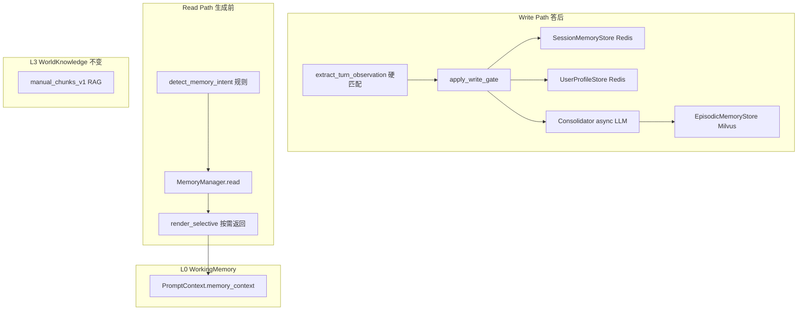
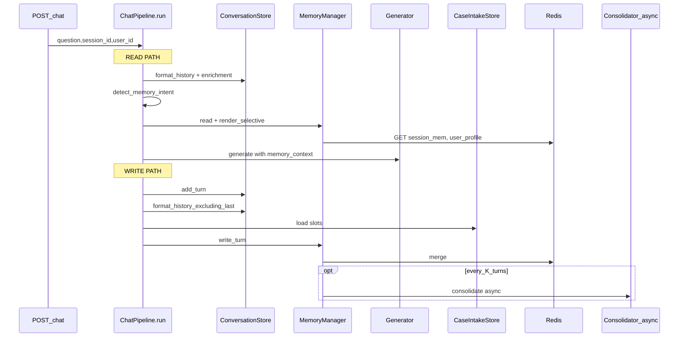
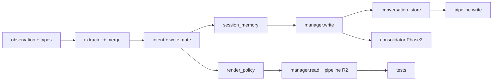

# 记忆系统 v2 — Agent 可执行实施规格书

> **用途：** 供 Coding Agent 按序实现记忆系统 v2，无需额外上下文。  
> **原则：** 在现有 `MemoryManager` + Redis/Milvus 骨架上扩展；`MEMORY_ENABLED=false` 时行为必须与现网一致。  
> **抽取策略：** `extract_turn_observation` 使用 **硬匹配（regex + 槽位 + 规则 merge）**，主链路 **不调用 LLM**；LLM 仅用于异步 `consolidate`。

---

## Agent 执行须知

1. **严格按 Phase 1 → Phase 2 顺序**；Phase 1 完成且测试通过后再做 Phase 2。
2. **不可漏改** [§11 嵌入点详表](#11-全流程嵌入点详表) 中标记为「必须改」的项。
3. **向后兼容：** 旧 Redis JSON 缺新字段时，`from_dict` 用空 list/空 dict 默认。
4. **最小 diff：** 不重构无关模块；不删除 `render()` / `merge_turn_facts` 直到测试迁移完成。
5. **验证命令：**
   ```bash
   python -m pytest app/test/test_memory_extractor.py app/test/test_memory_system.py app/test/test_context_assembler.py -q
   ```

### 任务清单（Agent 逐项勾选）

**Phase 1**

- [ ] **T1** 新增 `app/services/memory/observation.py`；扩展 `app/services/memory/types.py`
- [ ] **T2** 新增 `extractor.py` + `merge.py`（五源硬匹配 + merge）
- [ ] **T3** 新增 `intent.py` + `write_gate.py`
- [ ] **T4** `session_memory.merge_turn_observation` + `memory_index`
- [ ] **T5** 改 `manager.read` / `manager.write_turn`
- [ ] **T6** `conversation_store.format_history_excluding_last`
- [ ] **T7** 改 `pipeline.py` Read(R2) + Write(W1-W5) 全分支
- [ ] **T8** 新增 `render_policy.py` + `MemoryBundle.render_selective`
- [ ] **T9** `config.py` 新增 3 个开关
- [ ] **T10** 测试 Phase 1

**Phase 2**

- [ ] **T11** Milvus 加 `topic`；`episodic_store.search(intent=...)`
- [ ] **T12** `consolidator` 传 `recent_turns`；CaseIntake DONE 触发 consolidate
- [ ] **T13** `UserProfile.open_issues` + `upsert_from_observation`
- [ ] **T14** 测试 Phase 2

---

## 0. 设计总览

### 0.1 现状（已实现，保留）

| 组件 | 路径 | 职责 |
|------|------|------|
| 门面 | `app/services/memory/manager.py` | `read` / `write_turn` / `consolidate` / `forget` |
| L1 | `app/services/memory/session_memory.py` | Redis `kf:session_mem:{sha256(session_id)}` |
| L2 Profile | `app/services/memory/user_profile_store.py` | Redis `kf:user_profile:{sha256(user_key)}` |
| L2 Episodic | `app/services/memory/episodic_store.py` | Milvus `user_memory_v1` |
| 蒸馏 | `app/services/memory/consolidator.py` | LLM JSON + 规则兜底 |
| 嵌入 | `app/services/pipeline.py` L164-170 / L678-697 | 生成前 read，答后 write |
| 开关 | `MEMORY_ENABLED=false` | `app/core/config.py` L221-246 |

**已知缺口（本规格要补）：**

- `write_turn` 仅调 `extract_critical_facts(question, answer)`，无多源、无完整 history
- `consolidate` 未传入 `recent_turns`（恒为 `[]`）
- `MemoryBundle.render()` 全量拼接，无 intent 按需返回
- 未接入 CaseIntake `CaseState.slots`
- Milvus 无 `topic` 标量字段

### 0.2 目标架构



### 0.3 核心技术选型（全局锁定，不可擅自更改）

| 环节 | 选型 | 理由 |
|------|------|------|
| 每轮抽取 | **硬匹配**：regex + CaseIntake + priority merge | 同步、零 API、<10ms |
| issue_summary Phase 1 | **规则拼接** | 不阻塞主链路 |
| Write Gate | **纯 Python 规则** | 可测试 |
| Intent | **关键词规则** + case_intake_pending | 无新 LLM |
| 异步蒸馏 | `simple_llm_model` via `call_simple_llm_json` | 已有；失败走 heuristic |
| Episodic embed | Ollama `embed_model_zh` bge-m3 | 已有 episodic_store |
| L1/L2 | Redis STRING + JSON | 沿用 |
| L2 Episodic | Milvus HNSW + user_key filter | 沿用 |
| Token 预算 | `CONTEXT_MEMORY_TOKEN_BUDGET=600` | render_selective 在 Assembler 前裁剪 |
| 隐私 | `sha256:user:{id}` / `sha256:phone:{phone}` | 沿用 hash_user_key |

**明确不做：** 每轮 LLM 抽取；新建 ES；Session TTL sweeper（Phase 3）；CRM API（Phase 3）。

### 0.4 端到端全链路（POST /chat）

**顺序约束：Read 在生成前；Write 在 `add_turn` 之后。**



| 阶段 | 时机 | 记忆动作 | 阻塞用户 |
|------|------|----------|----------|
| T0 | run 开头 | Read + selective render | 是 |
| T1 | rewrite | memory → QueryRewriter | 是 |
| T2 | generate | memory → ContextAssembler → Prompt | 是 |
| T3 | add_turn 后 | Write 多源抽取 + Redis | 是 +5~15ms |
| T4 | 每 K 轮 | Consolidator + Milvus | 否 async |

### 0.5 三 Store 边界

| Store | Key | 存什么 | 记忆 v2 用法 |
|-------|-----|--------|--------------|
| ConversationStore | `kf:conversation:{sha256}` | QA 原文 | Write 读 `format_history_excluding_last`；**不替代** SessionMemory |
| SessionMemory L1 | `kf:session_mem:{sha256}` | 结构化槽位+index | v2 核心扩展 |
| CaseIntakeStore | `kf:case_intake:{sha256}` | 工单 slots | 抽取 priority=100 |
| UserProfile L2 | `kf:user_profile:{sha256}` | 跨 session 画像 | v2 +open_issues |
| Episodic L2 | Milvus | 向量记忆 | v2 +topic filter |

### 0.6 memory_context 双消费通道

1. **Prompt Builder**（`rag_manual.py` 等）→ 「可用记忆」区块  
2. **ContextAssembler**（`assembler.py` L27-33）→ 从 memory 再抽 `[关键事实]`

**因此 selective 输出必须保留** `产品/型号:`、`订单号:` 等标签格式。

### 0.7 四层记忆 L0-L3

| 层 | 实现 | v2 变化 |
|----|------|---------|
| L0 | PromptContext.memory_context | render_selective 生成 |
| L1 | Redis session_mem | +memory_index, +recent_turns |
| L2a | Redis user_profile | +open_issues Phase2 |
| L2b | Milvus episodic | +topic, intent filter |
| L3 | manual_chunks RAG | 不变 |

---

## 1. 需新建/修改的文件清单

### 1.1 新建文件

| 文件 | 职责 |
|------|------|
| `app/services/memory/observation.py` | TurnObservation, PartialObservation, MemoryIndex, WriteDecision, MemoryIntent |
| `app/services/memory/extractor.py` | `extract_turn_observation` + 五源抽取 |
| `app/services/memory/merge.py` | `merge_partials` |
| `app/services/memory/intent.py` | `detect_memory_intent` |
| `app/services/memory/write_gate.py` | `apply_write_gate` |
| `app/services/memory/render_policy.py` | RENDER_POLICY, estimate_tokens |
| `app/test/test_memory_extractor.py` | 多源 merge 单测 |

### 1.2 修改文件

| 文件 | 改动 |
|------|------|
| `app/services/memory/types.py` | 扩展 SessionFacts/SessionMemory/UserProfile/MemoryNote；`render_selective` |
| `app/services/memory/session_memory.py` | `merge_turn_observation` |
| `app/services/memory/manager.py` | read/write/consolidate 签名与逻辑 |
| `app/services/memory/user_profile_store.py` | `upsert_from_observation` |
| `app/services/memory/episodic_store.py` | `search(..., intent=)` Phase2 |
| `app/services/memory/consolidator.py` | recent_turns Phase2 |
| `app/services/conversation_store.py` | `format_history_excluding_last` |
| `app/services/conversation_store_redis.py` | 同上（若 Redis 实现分离） |
| `app/services/pipeline.py` | R2 Read + W1-W5 Write |
| `app/core/config.py` | 3 个新开关 |
| `app/services/memory/__init__.py` | 导出新符号 |
| `app/test/test_memory_system.py` | 扩展用例 |

---

## 2. 数据模型

### 2.1 observation.py

```python
MemoryIntent = Literal[
    "howto", "repair", "complaint", "status_check",
    "policy", "case_intake", "chitchat",
]

@dataclass(frozen=True)
class PartialObservation:
    source: str       # case_intake | context_block | current_turn | visual | history
    priority: int     # 100 | 80 | 70 | 60 | 50
    order_ids: list[str] = field(default_factory=list)
    phones: list[str] = field(default_factory=list)
    product_models: list[str] = field(default_factory=list)
    product_categories: list[str] = field(default_factory=list)
    fault_codes: list[str] = field(default_factory=list)
    symptoms: list[str] = field(default_factory=list)
    user_goals: list[str] = field(default_factory=list)
    visual_entities: list[str] = field(default_factory=list)
    missing_slots: list[str] = field(default_factory=list)
    attempted_actions: list[str] = field(default_factory=list)
    assistant_commitments: list[str] = field(default_factory=list)
    issue_text: str = ""

@dataclass(frozen=True)
class TurnObservation:
    session_id: str
    timestamp: float
    intent: MemoryIntent
    order_ids: list[str] = field(default_factory=list)
    phones: list[str] = field(default_factory=list)
    product_models: list[str] = field(default_factory=list)
    product_categories: list[str] = field(default_factory=list)
    fault_codes: list[str] = field(default_factory=list)
    symptoms: list[str] = field(default_factory=list)
    user_goals: list[str] = field(default_factory=list)
    visual_entities: list[str] = field(default_factory=list)
    missing_slots: list[str] = field(default_factory=list)
    attempted_actions: list[str] = field(default_factory=list)
    assistant_commitments: list[str] = field(default_factory=list)
    issue_summary: str = ""
    resolution_status: str = "open"
    sources: dict[str, str] = field(default_factory=dict)
    ephemeral: bool = False

    def has_slot_changes(self) -> bool:
        return bool(
            self.order_ids or self.phones or self.product_models
            or self.fault_codes or self.symptoms or self.user_goals
            or self.attempted_actions or self.assistant_commitments
        )

@dataclass(frozen=True)
class MemoryIndex:
    active_intent: str = ""
    product_hint: str = ""
    issue_hint: str = ""
    resolution_status: str = "open"
    issue_summary: str = ""

@dataclass(frozen=True)
class WriteDecision:
    update_session: bool = True
    update_profile: bool = False
    upsert_episodic: bool = False
    episodic_candidates: list = field(default_factory=list)
```

### 2.2 types.py 扩展

**SessionFacts 新增：** `product_categories`, `symptoms`, `assistant_commitments`, `field_provenance`

**SessionMemory 新增：** `memory_index: MemoryIndex`, `recent_turns: list[dict]`（max 3）

**MemoryBundle 新增：**

```python
intent: MemoryIntent = "chitchat"

def render_selective(self, *, intent: MemoryIntent | None = None, budget_tokens: int = 600) -> str: ...
```

### 2.3 Redis JSON v2 示例

```json
{
  "session_id": "sess-abc",
  "turn_count": 3,
  "memory_index": {
    "active_intent": "repair",
    "product_hint": "AC900",
    "issue_hint": "E2",
    "resolution_status": "open",
    "issue_summary": "AC900 E2，断电无效"
  },
  "facts": {
    "order_ids": ["ORD-20260301"],
    "phones": ["13800138000"],
    "product_models": ["AC900"],
    "product_categories": ["空调"],
    "fault_codes": ["E2"],
    "symptoms": [],
    "user_goals": ["报修"],
    "attempted_actions": ["断电重启"],
    "assistant_commitments": ["24h内回电"],
    "field_provenance": {"product_models": "case_intake"}
  },
  "summary": "产品 AC900；故障 E2",
  "recent_turns": [{"q": "...", "a": "...", "turn": 2}],
  "updated_at": 1717651200.0
}
```

---

## 3. Write Path

### 3.1 extract_turn_observation（硬匹配，无 LLM）

**签名：**

```python
def extract_turn_observation(
    *,
    session_id: str,
    question: str,
    answer: str,
    conversation_history: str = "",
    visual_context: str = "",
    context_block: str = "",
    case_state: CaseState | None = None,
) -> TurnObservation
```

**五源与 priority：**

| 函数 | 源 | priority | 方法 |
|------|-----|----------|------|
| `_extract_from_case_intake` | CaseState.slots | 100 | 直接映射 |
| `_extract_from_context_block` | context_block | 80 | missing_slots |
| `_extract_from_current_turn` | Q+A | 70 | extract_critical_facts + attempted + commitments + inline model |
| `_extract_from_visual` | visual_context | 60 | VISUAL_ENT + category |
| `_extract_from_history` | conversation_history | 50 | extract_critical_facts |

**CaseIntake 映射：**

| slot | 字段 |
|------|------|
| contact_phone | phones |
| order_id | order_ids |
| product_model | product_models |
| issue | issue_text + symptoms + fault_codes regex |
| attempted_actions | attempted_actions |

**merge 规则：**

- list 字段：并集 `_unique`
- user_goals：**仅** current_turn
- issue_text：最高 priority 非空 wins
- sources：记录每字段首次非空来源

**新增 regex（extractor.py）：**

```python
_INLINE_MODEL_RE = re.compile(
    r"\b([A-Z]{1,4}\d{2,6}[A-Z0-9-]*)\s*(?:电钻|空调|冰箱|洗碗机|追踪器|温控器)?", re.I)
_CATEGORY_KEYWORDS = ("空调", "电钻", "冰箱", "洗碗机", "烤箱", "发电机", "健身", "追踪器", "温控器", "键盘", "鼠标", "电视")
_COMMITMENT_PATTERNS = (
    r"(\d+\s*小时(?:内|之)?(?:回电|联系|处理|回复))",
    r"((?:已记录|会|将)(?:安排|为您)[^。！？\n]{2,40})",
)
```

**issue_summary：** `{product[0]}，{fault[0] or symptom[0]}，已尝试{attempted[-1]}`（存在才拼）

### 3.2 apply_write_gate

```python
def apply_write_gate(obs: TurnObservation, *, user_key: str) -> WriteDecision:
    update_session = obs.has_slot_changes() or bool(obs.assistant_commitments)
    update_profile = bool(user_key) and bool(obs.phones or obs.product_models or obs.order_ids)
    mark_episodic = (
        bool(user_key) and obs.intent in ("repair", "complaint")
        and bool(obs.issue_summary) and not obs.ephemeral
    )
    if obs.intent == "howto":
        mark_episodic = False
    return WriteDecision(update_session=update_session, update_profile=update_profile, ...)
```

Episodic **不在 write_turn 同步写 Milvus**；仍由 consolidate 异步 upsert。

### 3.3 merge_turn_observation（session_memory.py）

1. TurnObservation → SessionFacts（含 provenance）
2. `current.facts.merge(incoming)`
3. 更新 `memory_index` via `build_memory_index`
4. `turn_count += 1`；append recent_turns（max 3）
5. turn_count >= `MEMORY_SESSION_SUMMARY_TRIGGER_TURNS` → `_rollup_summary`
6. Redis SET

### 3.4 manager.write_turn

```python
def write_turn(..., conversation_history: str = "", case_state: CaseState | None = None):
    obs = extract_turn_observation(...)
    user_key = self.resolve_user_key(user_id=..., session_memory=..., question=question)
    decision = apply_write_gate(obs, user_key=user_key)
    session = self.session_store.merge_turn_observation(session_id, obs, question=question, answer=answer)
    if decision.update_profile and user_key:
        self.profile_store.upsert_from_observation(user_key, obs)
    if self._should_consolidate(session):
        self._schedule_consolidation(session_id=..., user_id=...)
```

---

## 4. Read Path（按需返回）

### 4.1 detect_memory_intent（intent.py）

```python
_STATUS_KWS = ("进度", "处理到哪", "什么时候", "回电", "联系了吗", "工单状态")
_COMPLAINT_KWS = ("投诉", "赔偿", "假货", "翻新", "虚假宣传", "辱骂")
_REPAIR_KWS = ("报修", "故障", "坏了", "E2", "不转", "无法启动", "异响", "不能用")
_POLICY_KWS = ("退款", "退货", "换货", "发票", "运费", "退换货", "7天")
```

优先级：`case_intake_pending` > status > complaint > repair > policy > chitchat

### 4.2 RENDER_POLICY（render_policy.py）

| intent | session_fields | profile_fields | episodic_max |
|--------|----------------|----------------|--------------|
| howto | product_models, categories | products, categories | 1 |
| repair | all | products, open_issues | 3 |
| complaint | all | products, open_issues, historical_issues | 3 |
| status_check | orders, commitments, resolution_status | active_orders, open_issues | 1 |
| policy | orders, user_goals | active_orders | 1 |
| case_intake | missing_slots, product_models | products | 0 |
| chitchat | — | — | 0 |

预算优先级：identity > issue > commitments > attempted > open_issues > episodic

### 4.3 pipeline Read（R2，必改）

**位置：** `app/services/pipeline.py` 原 L164-168

```python
case_pending = bool(session_id and self.case_intake_skill.has_pending_intake(session_id))
intent = detect_memory_intent(question, case_intake_pending=case_pending)
bundle = self.memory_manager.read(
    session_id=session_id, user_id=user_id, query=question, intent=intent,
)
memory_context = (
    bundle.render_selective(intent=intent, budget_tokens=settings.context_memory_token_budget)
    if settings.memory_render_selective_enabled
    else bundle.render()
)
```

---

## 5. Consolidator（Phase 2）

- `consolidate(session, profile, recent_turns=session.recent_turns)`
- 模型：`settings.simple_llm_model`，temperature=0，max_tokens=768
- 失败：`_heuristic_consolidate`
- CaseIntake `skill_result.completed` → `manager.consolidate()` 同步调用一次
- LLM 输出 JSON：`profile_updates`, `memory_notes[{memory_text, topic}]`, `session_summary`

---

## 6. 配置项（config.py 新增）

```python
memory_extraction_inline_model_enabled: bool = Field(default=True, alias="MEMORY_EXTRACTION_INLINE_MODEL_ENABLED")
memory_render_selective_enabled: bool = Field(default=True, alias="MEMORY_RENDER_SELECTIVE_ENABLED")
memory_intent_rules_enabled: bool = Field(default=True, alias="MEMORY_INTENT_RULES_ENABLED")
```

---

## 7. 测试与验收

### 7.1 测试用例

**test_memory_extractor.py**

- case_intake(100) 覆盖 history(50) 的 product_model
- 第 3 轮无型号，history 补 AC900
- `DCB101 电钻` inline model
- answer 含「24小时回电」→ commitments
- user_goals 仅 current_turn

**test_memory_system.py**

- render_selective(howto) 无 commitments
- render_selective(repair) 有 attempted_actions
- MEMORY_ENABLED=false → 空 bundle

### 7.2 验收标准

- [ ] 第 3 轮「安排上门」仍能关联 AC900
- [ ] howto 不含报障 commitments
- [ ] repair 含 attempted_actions
- [ ] CaseIntake slots 优先于 regex
- [ ] consolidate 收到 recent_turns 非空（Phase 2）
- [ ] MEMORY_ENABLED=false 行为不变

---

## 8. 成本与延迟

| 路径 | 增量延迟 | API 成本 |
|------|----------|----------|
| extract_turn_observation | +5~10ms | 0 |
| render_selective | +1ms | 0 |
| episodic search repair | +50~200ms Ollama | 0 |
| howto/chitchat 跳过 episodic | 0 | 0 |
| consolidate async / K 轮 | 不阻塞 | ~¥0.002~0.005/次 |

---

## 9. 模块接口契约

| 模块 | 文件 | API |
|------|------|-----|
| 抽取 | extractor.py | `extract_turn_observation` |
| 合并 | merge.py | `merge_partials` |
| 意图 | intent.py | `detect_memory_intent` |
| 写门控 | write_gate.py | `apply_write_gate` |
| 读策略 | render_policy.py | `RENDER_POLICY` |
| L1 | session_memory.py | `merge_turn_observation` |
| L2 | user_profile_store.py | `upsert_from_observation` |
| 门面 | manager.py | `read(..., intent)`, `write_turn(..., history, case_state)` |
| 渲染 | types.py | `render_selective` |

---

## 10. Phase 3 Backlog（勿在本 PR 实现）

- Session TTL sweeper
- CRM/订单 API tool_results（priority=90）
- Memory eval 数据集

---

## 11. 全流程嵌入点详表

### 11.1 API（无改动）

- `app/schemas/chat.py` — `user_id` 已有
- `app/main.py` L66-70 — 已传 user_id

### 11.2 Read 侧（必改）

| ID | 文件 | 改动 |
|----|------|------|
| R2 | pipeline.py L164-168 | intent + read + render_selective（见 §4.3） |
| R4 | pipeline.py L174 | case_intake_pending 传给 detect_memory_intent |

### 11.3 分支传递（memory_context 已传，无需改签名）

| 分支 | 函数 |
|------|------|
| CaseIntake 取消 | `_build_case_intake_cancelled_result` |
| CaseIntake | `_maybe_run_case_intake_branch` |
| No-RAG | `_run_no_rag_branch` |
| RAG | `_build_rag_prompt` |

### 11.4 二次消费（无改动，注意格式）

- `context/assembler.py` L27-33 — extract_critical_facts(memory_context)
- `query_rewriter.py` L38-46
- `prompts/builders/rag_manual.py`

### 11.5 Write 侧（必改全分支）

**`_record_memory_turn` 目标实现：**

```python
def _record_memory_turn(
    self, *, session_id, user_id, question, answer,
    visual_context, context_block, store,
):
    if not (settings.memory_enabled and session_id):
        return
    history = store.format_history_excluding_last(session_id) if store else ""
    from app.services.skills.case_intake_redis_store import get_case_intake_state_store
    case_state = get_case_intake_state_store().load(session_id or "")
    self.memory_manager.write_turn(
        session_id=session_id,
        user_id=user_id,
        question=question,
        answer=answer,
        visual_context=visual_context,
        context_block=context_block,
        conversation_history=history,
        case_state=case_state,
    )
```

**调用点（add_turn 之后）：**

| ID | 位置 |
|----|------|
| W2 | pipeline.py RAG 分支 ~L270-282 |
| W3 | No-RAG ~L500-510 |
| W4 | CaseIntake ~L432-444 |
| W5 | CaseIntake 取消 ~L368 |

**Phase 2：** CaseIntake DONE → `consolidate(session_id, user_id)`

### 11.6 conversation_store 新增

```python
def format_history_excluding_last(self, session_id: str) -> str:
    session = self.get_or_create(session_id)
    turns = session.turns[:-1][-self._max_turns:]
    # 同 format_history 格式化 turns
```

Redis 实现类同步添加。

### 11.7 MEMORY_ENABLED=false

- `read()` → 空 MemoryBundle
- `write_turn()` → 早退
- `test_memory_manager_is_disabled_by_default` 必须 pass

---

## 12. 实施依赖图



**Write 闭环：** T1→T2→T4→T5→T6→T7  
**Read 闭环：** T1→T8→T9  
可并行，最后集成测试。

---

*文档版本：v2.0 | 与 Cursor Plan `记忆系统_v2_实施` 同步*
