# 多模态 V2 精读说明（含代码位置索引）

> 本文档按**离线建库 → 在线检索**组织，每个步骤标注 **`文件路径:行号`** 与入口函数。  
> 行号随代码演进可能偏移，请以函数名为锚点用 IDE 跳转核对。

---

## 目录

- [0. 代码地图（速查表）](#0-代码地图速查表)
- [1. 架构总览](#1-架构总览)
- [2. 离线索引：文本 chunk 建库](#2-离线索引文本-chunk-建库)
- [3. 离线索引：手册图片建库](#3-离线索引手册图片建库)
- [4. 在线检索：Pipeline 主流程](#4-在线检索pipeline-主流程)
- [5. 在线检索：VectorRetriever 文本 RAG](#5-在线检索vectorretriever-文本-rag)
- [6. 在线检索：图片三路召回与回填](#6-在线检索图片三路召回与回填)
- [7. Prompt 与赛题输出格式](#7-prompt-与赛题输出格式)
- [8. 配置项与代码绑定](#8-配置项与代码绑定)
- [9. 推荐阅读顺序](#9-推荐阅读顺序)
- [10. 创新点 / 难点 / 不足](#10-创新点--难点--不足)

---

## 0. 代码地图（速查表）

| 阶段 | 职责 | 主文件 | 入口 |
|------|------|--------|------|
| 手册解析切块 | `<PIC>`→``，产出 `ManualChunk` | `app/services/ingestion.py` | `ManualIngestionService.parse_and_chunk` **L293-314** |
| 文本建库脚本 | Ollama embed → `manual_chunks_v1` | `scripts/build_index.py` | `main` **L91+** |
| 文本 Milvus schema | dense/sparse/BM25 | `app/services/milvus_create.py` | `build_collection` **L44-100** |
| 图片资产扫描 | catalog + 质量报告 | `app/services/multimodal/catalog.py` | `build_manual_image_catalog` **L77-108** |
| 类型定义 | Asset / Understanding | `app/services/multimodal/types.py` | 全文 |
| VLM 结构理解 | JSON 抽取 + 缓存 | `app/services/multimodal/understanding.py` | `ManualImageInterpreter.understand_image` **L159-182** |
| LLM 网关 | 百炼/Ollama 图文 | `app/services/llm_clients.py` | `chat_with_image` **L44-81** |
| Jina 双向量 | image / semantic embed | `app/services/multimodal/embeddings.py` | `JinaMultimodalEmbeddingClient` |
| 图片建库脚本 | 编排 + 进度 | `scripts/build_image_index.py` | `main` **L174-319** |
| 图片 Milvus schema | `manual_images_v1` | `app/services/milvus_create.py` | `build_image_collection` **L151-182** |
| 检索器 | 文本 RAG + 图片增强 | `app/services/retriever.py` | `VectorRetriever.retrieve` **L207-284** |
| 运行时用户图摘要 | 拼进 routing_query | `app/services/vision.py` | `VisionInterpreter.summarize_images` **L90-136** |
| 多模态 Prompt | 结构证据 + PIC | `app/utils/prompt_builder.py` | `build_multimodal_context_block` **L78-143** |
| 流水线 | 串联 | `app/services/pipeline.py` | `Pipeline.run` **L208-369** |
| 上下文压缩 | 生成前裁剪 | `app/services/context/assembler.py` | `ContextAssembler.assemble` |
| 配置 | env | `app/core/config.py` | `Settings` **L210-252**（多模态段） |

---

## 1. 架构总览

### 1.1 双 Collection 不混用

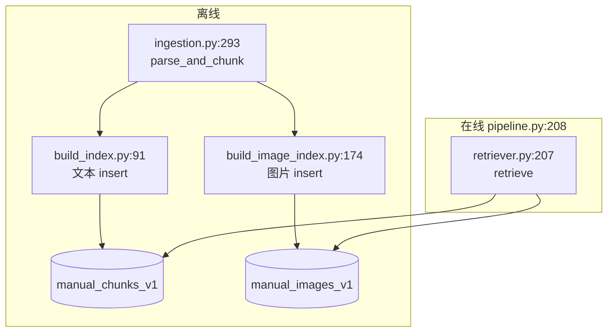

**设计注释位置**：`milvus_create.py:151-155` 明确图片 collection **不修改**原有 chunk collection。

### 1.2 三类「图」对象（必读）

| 对象 | 定义位置 | 生命周期 |
|------|----------|----------|
| `ManualImageAsset` | `types.py:9-19` | 离线索引：磁盘路径 + `parent_chunk_ids` |
| `ManualImageUnderstanding` | `types.py:32-107` | 离线索引：VLM JSON；`to_semantic_text` **L81-103** |
| `ManualImageEvidence` | `retriever.py:30-39` | 在线：检索命中包装 |
| `RetrievedChunk.image_evidence` | `retriever.py:42-51` | 在线：挂在文本 chunk 上 |

---

## 2. 离线索引：文本 chunk 建库

### 2.1 流程图

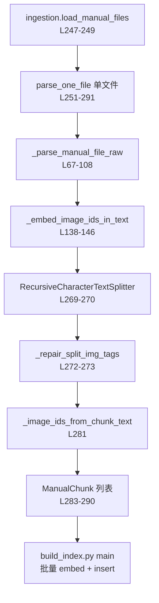

### 2.2 步骤与代码位置

#### 步骤 1：解析手册字面量

- **文件**：`app/services/ingestion.py`
- **函数**：`_parse_manual_file_raw` **L67-108**
- **行为**：`ast.literal_eval` 得到 `(body, image_ids)`；支持单行与多行汇总合并（**L95-108**）。

#### 步骤 2：`<PIC>` 与 `image_ids` 顺序绑定

- **函数**：`_pic_positions_and_binding` **L111-135**
- **警告**：PIC 多于 ids / ids 多于 PIC → `logger.warning` **L122-134**（建库终端常见）。

#### 步骤 3：替换为 ``

- **函数**：`_embed_image_ids_in_text` **L138-146**
- **要点**：从后往前替换，避免下标偏移。

#### 步骤 4：切块与 IMG 标签修复

- **切块**：`_make_recursive_splitter` **L193-207**，`parse_one_file` 内 **L269-270**（`chunk_size=800, overlap=120`）。
- **修复断裂标签**：`_repair_split_img_tags` **L149-165**
- **块内提取 image_ids**：`_image_ids_from_chunk_text` **L168-177**（正则 `]+)>`，**L39**）

#### 步骤 5：遍历目录

- **函数**：`parse_and_chunk` **L293-314** — 对手册目录每个 `.txt` 调用 `parse_one_file`，异常则 `logger.exception` 跳过。

#### 步骤 6：写入 Milvus（文本）

- **脚本**：`scripts/build_index.py`
- **入口**：`main` **L91+**
- **维数校验**：`dim_en` vs `dim_zh` **L100-108**
- **Schema**：`milvus_create.build_collection` **L44-100**
  - 字段：`chunk_id`, `dense_vector`, `text`（中文分词 **L65-71**）, `image_ids`, `manual_name`
  - 可选 BM25：`sparse_vector` **L80-98**
- **批量嵌入**：`_embed_batch_bilingual` **L57-80**，循环 insert **L158-199**
- **建索引**：`_create_vector_index` **L103-148**

---

## 3. 离线索引：手册图片建库

### 3.1 流程图

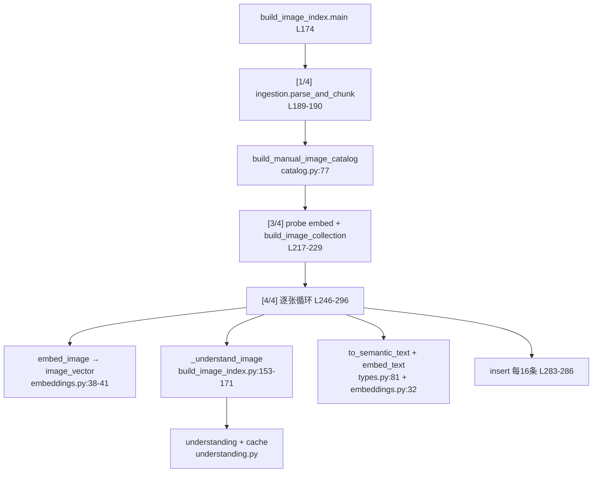

### 3.2 阶段 [1/4]：资产扫描

**调用链**（`build_image_index.py:188-194`）：

```text
ManualIngestionService(settings.manual_dir).parse_and_chunk()
  → build_manual_image_catalog(chunks, image_dir=settings.manual_image_dir)
  → _write_report(report)  # L135-150 → manual_image_asset_report.json
```

**`catalog.py` 核心逻辑**：

| 函数 | 行号 | 作用 |
|------|------|------|
| `scan_image_files` | **L34-59** | 扫 `MANUAL_IMAGE_DIR`，`stem` = `image_id`；收集 duplicate/case_conflict |
| `build_parent_links` | **L62-74** | 从每个 `chunk.image_ids` 反查 `parent_chunk_ids` / `parent_manual_names` |
| `build_manual_image_catalog` | **L77-108** | `referenced ∩ available` → `catalog`；`missing` / `orphan` 进报告 |

**`ManualImageAsset` 字段**：`types.py:9-19`（含 `file_hash` **L100** 由 `catalog.file_sha256` **L15-21** 计算）。

### 3.3 阶段 [2/4]：客户端初始化

- **位置**：`build_image_index.py:206-215`
- `ManualImageUnderstandingCache(settings.manual_image_cache_path)` — 缓存实现 **understanding.py:80-137**
- `ManualImageInterpreter()` — 模型解析 **understanding.py:150-155**
- `JinaMultimodalEmbeddingClient()` — **embeddings.py:14-30**

**前置校验**（`build_image_index.py:178-186`）：

- `MULTIMODAL_EMBED_PROVIDER` 必须为 `jina_api`
- `JINA_API_KEY` 非空

### 3.4 阶段 [3/4]：Milvus 图片 collection

- **probe**：`embedder.embed_image(first_asset.image_path)` **L221** → 得到实际 `dim`
- **建表**：`milvus_create.build_image_collection(client, vector_dim=dim)` **L229**

**Schema 字段**（`milvus_create.py:162-181`）：

| 字段 | 行号 | 用途 |
|------|------|------|
| `image_id` | L163-168 | 主键 |
| `image_vector` | L169 | 原图像素语义 |
| `semantic_vector` | L170 | 结构化语义文本向量 |
| `parent_chunk_ids` | L173 | JSON 字符串，在线回填用 |
| `parent_context_text` | L174 | schema 有；见 [不足](#103-已知不足) |
| `context_intent` | L175 | 同上 |
| `semantic_text` | L177 | 同上 |
| `ocr_text` / `visual_entities` / … | L178-181 | 实体匹配与 prompt |

**索引**：`create_image_vector_index` **L185-198** — `image_vector`、`semantic_vector` 各建 HNSW；`manual_name` TRIE。

### 3.5 阶段 [4/4]：逐张索引循环

**主循环**：`build_image_index.py:246-296`

对每张 `asset`：

1. **`image_vector`**  
   - `embedder.embed_image(asset.image_path)` **L248**（首张复用 probe **L248**）  
   - 实现：`embeddings.py:38-41` → POST payload `{"image": base64}` **L66**

2. **VLM 结构理解**  
   - `_understand_image` **L153-171**  
     - 缓存命中：`cache.get` **L160-162** → 返回 `(cached, True)`  
     - 未命中：`interpreter.understand_image` **L164** → `cache.set` **L170**  
   - 失败降级：`ManualImageUnderstanding(image_id=...)` 空结构 **L169**

3. **`semantic_vector`**  
   - `understanding.to_semantic_text()` **types.py:81-103**  
   - `embedder.embed_text(semantic_text)` **L257-258**

4. **insert 行结构**（**L263-276**）— 当前写入字段：

```python
# scripts/build_image_index.py:263-276（摘录）
{
    "image_id", "image_vector", "semantic_vector", "image_path",
    "manual_name", "parent_chunk_ids", "image_type",
    "ocr_text", "visual_entities", "operation_steps", "warnings",
}
```

5. **批量 flush**：`len(rows) >= MILVUS_INSERT_BATCH`（16）→ `client.insert` **L283-286**

**进度条**：`_BuildProgress` **build_image_index.py:41-114**；`main` 末尾汇总 **L313-318**。

### 3.6 VLM 调用链（精读）

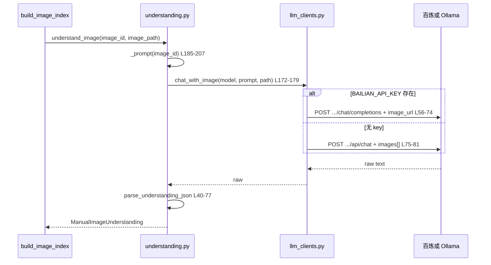

**JSON 解析**：`parse_understanding_json` **understanding.py:40-77** — 支持 markdown 代码块；失败则 `raw_text` 降级 **L61-62**。

**缓存失效条件**（`cache.get` **L94-114**）：

- `file_hash` 变化  
- `vision_model` 配置变化  
- `parent_context_hash` 变化（若传入 `parent_context_text`）

> **注意**：当前 `build_image_index._understand_image` **L164** 未传 `parent_context_text`；VLM 与 Milvus 的 `parent_context_text`/`context_intent` 字段能力在 schema 与 retriever 已预留，建库脚本尚未完全写入（见 §10.3）。

---

## 4. 在线检索：Pipeline 主流程

### 4.1 总流程图

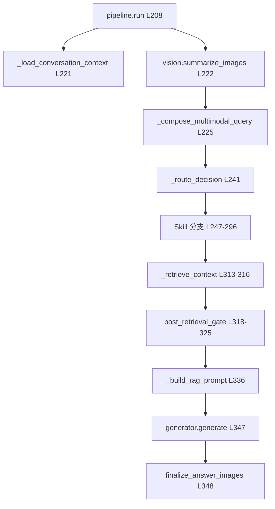

### 4.2 关键代码位置

| 步骤 | 文件:行号 | 说明 |
|------|-----------|------|
| 会话历史 | `pipeline.py:221` | `store.format_history` / `format_enrichment` |
| 用户图摘要 | `pipeline.py:222` → `vision.py:90-136` | `chat_with_image_inputs` **llm_clients.py:84-119** |
| 检索 query | `pipeline.py:225` | `_compose_multimodal_query` **L930+**：问题 + `【用户上传图片的视觉摘要】` |
| 检索入口 | `pipeline.py:313-316` | `_retrieve_context(routing_query, image_inputs=images)` |
| 多 query | `pipeline.py:727-744` | `_build_retrieval_queries` **L746-793** + `query_construction` 定 `manual_name` |
| 拼 prompt | `pipeline.py:823-838` | `build_multimodal_context_block(filter_context)` |
| 压缩 + 生成 | `pipeline.py:846-854` | `ContextAssembler.assemble` → `compose_generation_prompt` |
| 答案 PIC | `pipeline.py:348` | `finalize_answer_images` **prompt_builder.py:146-190** |

### 4.3 用户图 vs 手册图（在线）

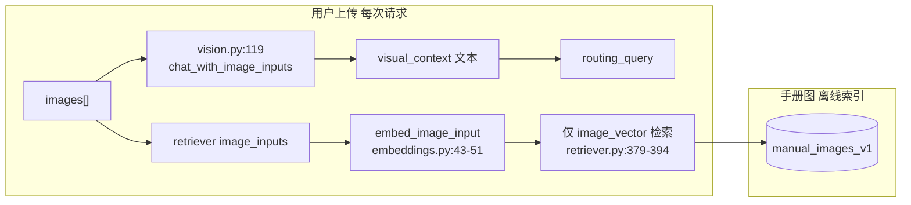

---

## 5. 在线检索：VectorRetriever 文本 RAG

### 5.1 初始化

**`VectorRetriever.__init__`** — `retriever.py:100-135`

- 连接 Milvus **L110-113**
- `_probe_schema` **L151-175** → `dense_field`, `sparse_enabled`
- `_probe_image_collection` **L177-185** → `image_retrieval_enabled`
- `_ensure_loaded` **L137-149**

### 5.2 `retrieve` 主路径

**入口**：`retriever.py:207-284`

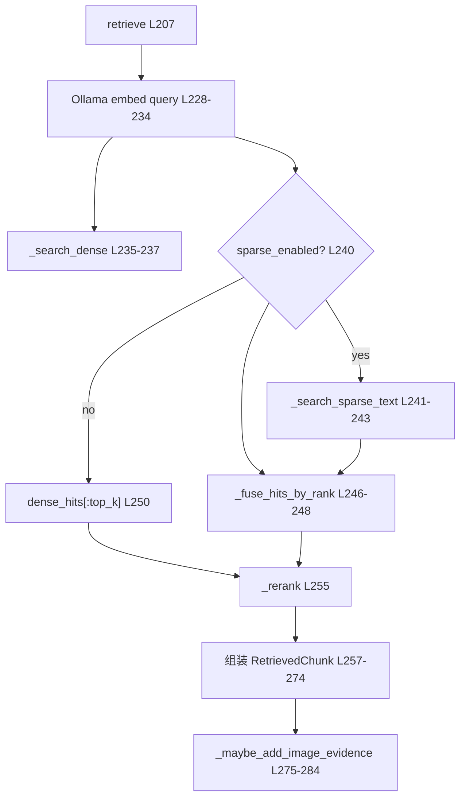

| 子步骤 | 行号 | 说明 |
|--------|------|------|
| 手册过滤表达式 | `_milvus_manual_name_filter_expr` **L84-88** | `manual_name == "..."` |
| Dense 搜索 | `_search_dense` **L631-658** | `output_fields` 含 `image_ids` **L634** |
| Sparse BM25 | `_search_sparse_text` | 仅 `sparse_enabled` 时 |
| 融合 | `_fuse_hits_by_rank` **L653-685** | dense 0.7 + sparse 0.3，按 rank 倒数加权 |
| 精排 | `_rerank` **L647-649** | `rag_skill.rerank.rerank_fused_hits` |
| 分数过滤（Pipeline 侧） | `retriever_context_filter` **L75-77** | `settings.retriever_context_filter_score_threshold` |

---

## 6. 在线检索：图片三路召回与回填

### 6.1 前置门：必须有手册范围

**`_maybe_add_image_evidence`** — `retriever.py:291-321`

```text
if not image_retrieval_enabled: return chunks          # L304-305
if not manual_name: return chunks                    # L306-308  ← 无范围则跳过图片检索
try: image_hits = _retrieve_image_evidence(...)
except: 降级纯文本 RAG                               # L316-318
return _merge_image_evidence(chunks, image_hits)       # L321
```

**手册名从哪来**：

1. Pipeline `query_construction(routing_query)` → 传入 `retrieve(..., manual_name=...)` **pipeline.py:731-740**
2. 若未指定：`_resolve_image_manual_scope` **retriever.py:537-560** — 从文本 top chunk 的 `manual_name` 投票（≥60% 且 ≥2 条等同手册）

### 6.2 三路召回

**入口**：`_retrieve_image_evidence` **retriever.py:323-360**

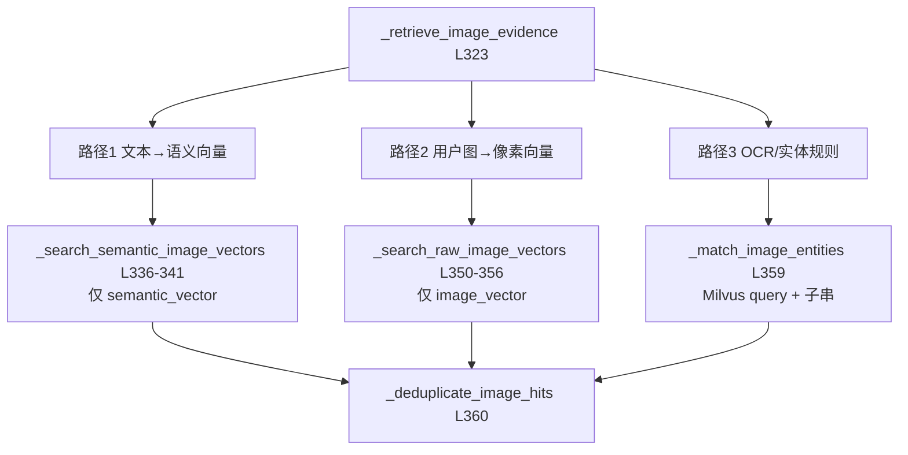

| 路径 | 代码位置 | 设计意图（见函数 docstring） |
|------|----------|------------------------------|
| 文本问题 | `_search_semantic_image_vectors` **L362-377** | 只搜 `semantic_vector`，避免文本问被「线条图像素」带偏 |
| 用户上传图 | `_search_raw_image_vectors` **L379-394** | 只搜 `image_vector` |
| 实体 | `_match_image_entities` **L449-503** | `_entity_tokens` **L732-743**；`score=1.0+` **L499** |

**向量搜索共用**：`_search_image_vectors` **L396-447** — `anns_fields` 参数控制搜哪些字段；`multimodal_image_min_score` **L439**。

**命中转证据**：`_image_hit_to_evidence` **L505-534** — 拼 `prompt_text`（类型、意图、OCR、实体、步骤、警告、父文本）。

### 6.3 回填父 chunk

**`_merge_image_evidence`** — `retriever.py:562-586`

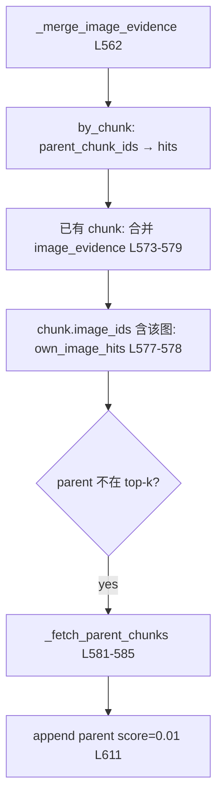

- **`_fetch_parent_chunks`** **L588-614** — 按 `chunk_id in [...]` 从 **文本 collection** 拉正文。
- **去重**：`_deduplicate_evidence` **L616-625** — 同 `image_id` 保留最高分。

### 6.4 观测 trace

**`RetrievalTrace.build_trace`** — `retriever.py:688-728`

- `image_vector_hits`：**L711-716**（`match_reason` 含「向量召回」）
- `ocr_entity_hits`：**L717-722**（含「OCR/实体」）
- `selected_image_ids`：**L723-728**

---

## 7. Prompt 与赛题输出格式

### 7.1 多模态上下文块

**`build_multimodal_context_block`** — `prompt_builder.py:78-143`

对每个 `RetrievedChunk`：

| 输出块 | 行号 | 内容 |
|--------|------|------|
| 片段元数据 | L94-98 | chunk_id、手册、分数、正文（含 ``） |
| 可引用图片 | L101-116 | `<IMG_1:真实id>`，写入 `image_ref_map` |
| 图片结构证据 | L117-136 | `[图片结构证据]` + score/reason + `evidence.prompt_text` |

**长度限制**：`_enforce_context_limit` **L52-56**，`MAX_CONTEXT_CHARS = 3000` **L37**。

### 7.2 生成前压缩

**`pipeline._compose_generation_prompt`** — `pipeline.py:846-854`

→ `ContextAssembler.assemble(ctx)`（若 `CONTEXT_ASSEMBLER_ENABLED`）→ `compose_generation_prompt`。

### 7.3 答案 → `<PIC>`

**`finalize_answer_images`** — `prompt_builder.py:146-190`

- 正则 `_UNIFIED_IMG` **L159** 匹配 `<IMG_n:id>` 与 ``
- `IMG_n` 须经 `image_ref_map` 校验 **L167-174**
- 替换为 `PIC_MARKER`（`<PIC>`）**L189**

---

## 8. 配置项与代码绑定

| 环境变量 | 定义 `config.py` | 读取位置示例 |
|----------|------------------|--------------|
| `MANUAL_DIR` | 手册目录 | `ingestion` **L245** |
| `MANUAL_IMAGE_DIR` | **L216** | `catalog` / `build_image_index` **L193** |
| `MANUAL_IMAGE_VLM_MODEL` | **L225-227** | `understanding` **L152**；缓存 **L107** |
| `BAILIAN_API_KEY` | **L26** | `llm_clients` **L27, L56** |
| `JINA_API_KEY` | **L244** | `embeddings` **L26, L64** |
| `MULTIMODAL_IMAGE_COLLECTION` | **L236-238** | `retriever` **L118** |
| `MULTIMODAL_IMAGE_RETRIEVAL_ENABLED` | **L212-214** | `retriever._probe_image_collection` **L179** |
| `MULTIMODAL_IMAGE_TOP_K` | **L250** | `retriever` **L312** |
| `MULTIMODAL_ENTITY_TOP_K` | **L251** | `retriever` **L359** |
| `MULTIMODAL_IMAGE_MIN_SCORE` | **L252** | `retriever` **L439** |
| `VISION_*` | **L36-40** | `vision.py` **L91-107** |

---

## 9. 推荐阅读顺序

### 第一遍：离线（带断点）

1. `ingestion.py:111-146` — PIC/IMG 绑定（理解数据根）
2. `ingestion.py:251-291` — 单文件切块
3. `catalog.py:62-108` — 资产与 parent 链接
4. `understanding.py:159-207` + `llm_clients.py:44-81` — VLM
5. `embeddings.py` 全文 — Jina 协议
6. `build_image_index.py:174-319` — 编排
7. `milvus_create.py:151-198` — 图片 schema

**断点建议**：在 `understanding.understand_image` 对单张 `手册/插图/*.png` 下断，打印 `to_semantic_text()`。

### 第二遍：在线

1. `pipeline.py:208-348` — `run` 主干
2. `pipeline.py:714-844` — 检索与 RAG prompt
3. `retriever.py:207-321` — retrieve + 图片门
4. `retriever.py:323-586` — 三路 + merge
5. `prompt_builder.py:78-190` — 上下文与 PIC

**断点建议**：`retrieve` 返回后打印每个 chunk 的 `image_evidence` 与 `match_reason`。

### 第三遍：横切

- `retriever.py:537-560` — 手册范围推断
- `context/assembler.py` — 与多模态证据是否被裁掉
- `eval/run_eval.py` — 评测如何看 trace

---

## 10. 创新点 / 难点 / 不足

### 10.1 创新点（对应代码）

| 创新 | 代码锚点 |
|------|----------|
| 双 Collection，文本主路径不变 | `milvus_create.py:151-155`；`retriever.py:300-303` 失败降级 |
| 结构化 VLM 非 caption | `types.py:32-38`；`understanding.py:185-207` |
| 语义/像素向量分路检索 | `_search_semantic_image_vectors` **L362-377** vs `_search_raw_image_vectors` **L379-394** |
| OCR/实体规则补强 | `_match_image_entities` **L449-503**；`_entity_tokens` **L732-743** |
| 图片命中回填未召回 chunk | `_merge_image_evidence` **L581-585**；`_fetch_parent_chunks` **L588-614** |
| 证据挂 `RetrievedChunk` 再渲染 prompt | `retriever.py:51`；`prompt_builder.py:117-136` |
| 赛题输出 `<PIC>` 不变 | `finalize_answer_images` **L146-190** |
| 百炼/Ollama 统一网关 | `llm_clients.py` 全文 |
| 离线索引可恢复 | `understanding.py:80-137` 缓存；`build_image_index.py` 进度 **L41-114** |
| 无手册范围不跑图片检索（降误召） | `retriever.py:306-308`；`_resolve_image_manual_scope` **L537-560** |

### 10.2 难点（实现与运维）

| 难点 | 表现 | 相关代码 |
|------|------|----------|
| PIC/image_ids 源数据不齐 | 建库 WARN | `ingestion.py:122-134` |
| 双嵌入体系 | Ollama + Jina，两套 key/配额 | `retriever.py:102-108`；`embeddings.py` |
| VLM JSON 不稳定 | 空结构降级 | `build_image_index.py:165-169`；`parse_understanding_json` **L61-62** |
| 全量图片索引成本 | ~2600×(VLM+2×Jina) | `build_image_index.py:246-296` |
| 图片检索依赖 manual_name | 无范围则跳过 | `retriever.py:306-308` |
| Milvus Lite / BM25 | schema 与功能不完整 | `milvus_create.py:1-11`；`build_index` 自检 **L127-150** |
| 上下文 3000 字截断 | 可能裁证据 | `prompt_builder.py:37-56`；`ContextAssembler` |
| schema 与 insert 字段不一致 | 见下节 | `milvus_create.py:174-177` vs `build_image_index.py:263-276` |

### 10.3 已知不足

| 不足 | 说明 | 代码位置 |
|------|------|----------|
| 建库未写满 Milvus 图片字段 | schema 有 `parent_context_text`、`context_intent`、`semantic_text`，但 `build_image_index` insert **L263-276** 未写入；VLM 调用 **L164** 也未传父 chunk 文本 | 应对齐 `understanding` 已支持的 `parent_context_text` **L164-170** |
| 生成模型不看像素 | 主要靠文字描述进 prompt | `GEN_MODEL`；`docs/multimodal_design.md` 远期 qwen-vl-max |
| 无图片 rerank | 向量分即最终序 | `_deduplicate_evidence` **L616-625** |
| 父 chunk 补拉分数低 | `score=0.01` **L611** 可能排序靠后 | `_fetch_parent_chunks` |
| ReAct 路径图片召回 | `react_enabled` 时走 `collect_evidence`，需单独确认是否带 `image_inputs` | `pipeline.py:717-725` |
| Jina 外网依赖 | 国内需代理/稳定网络 | `embeddings.py:72-87` |
| `prompt_builder` 3000 字符上限 | 与 `ContextAssembler` 双层裁剪可能重复 | **L37** vs `context/assembler.py` |

---

## 附录 A：单请求在线时序（带行号）

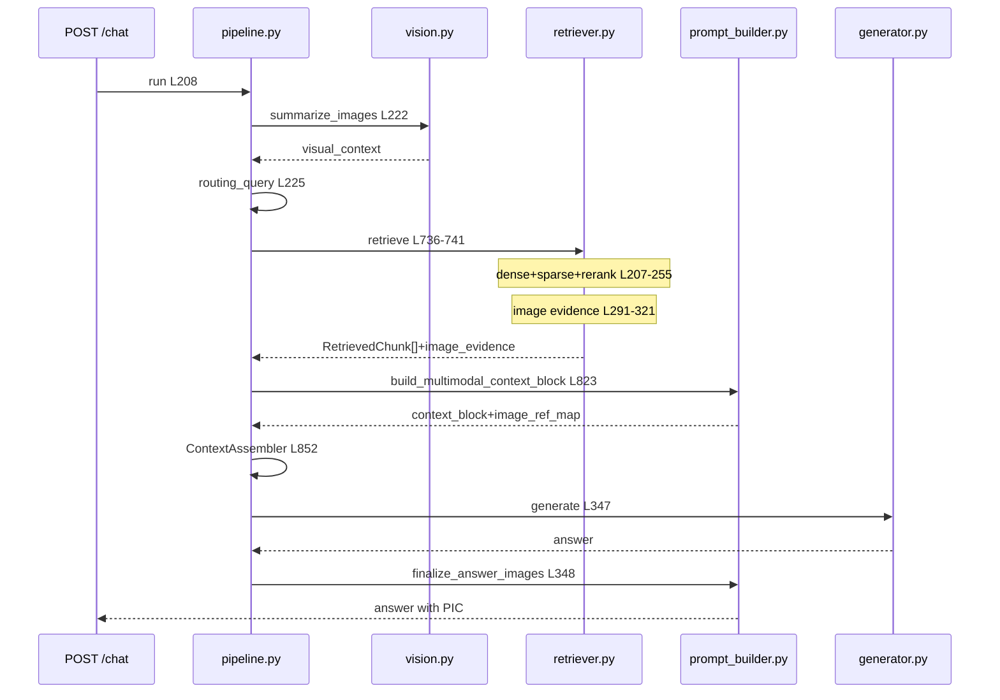

---

## 附录 B：文件依赖图（import 方向）

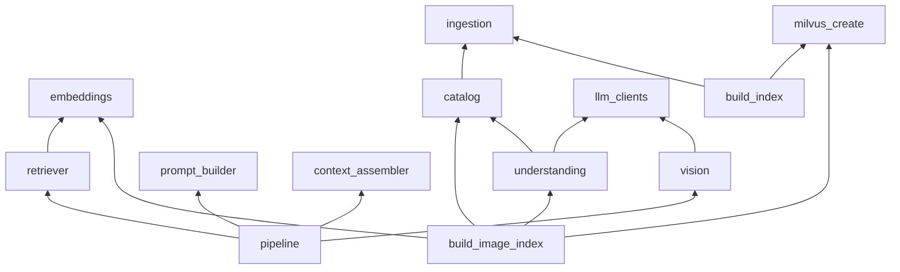

---

*文档路径：`docs/multimodal_v2_reading_guide.md`。若你修改了 `retriever` 的图片门控或 `build_image_index` 的 insert 字段，请同步更新 §3.5 与 §10.3。*
