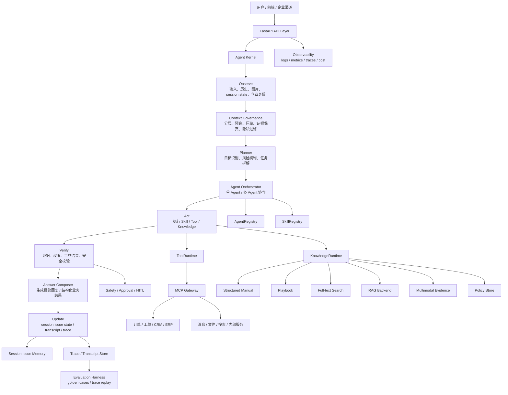

# nikon0 Architecture

## 目标

nikon0 的目标是把当前“多模态智能客服 RAG 系统”升级为“企业产品服务 Agent Framework”。它不是 LangChain / LangGraph 的包装层，而是自研 Agent Kernel：框架负责会话、上下文、能力注册、工具执行、安全、审计和评测；具体业务能力以 Agent、Skill、Tool、Knowledge Backend 的方式挂载。

第一业务场景是企业产品服务：

```text
用户提出产品咨询、故障排查、售后报修、订单/工单查询、退款/投诉等请求；
系统读取当前会话问题状态，治理上下文，选择合适 Agent/Skill/Tool；
在权限、安全和人工介入边界内完成答复、业务流转和审计记录。
```

核心执行循环：

```text
observe -> govern_context -> plan -> delegate -> act -> verify -> answer -> update
```

这意味着手册 RAG、工单、订单、图片理解、退款规则、投诉升级都不再是 pipeline 分支，而是 Runtime 可调度、可治理、可审计的能力。

## 设计原则

- 自研 Agent Kernel，不把核心编排绑定到某个外部 Agent 框架。
- RAG 只是 KnowledgeRuntime 的一个 backend，不是系统中心。
- Agent 和 Skill 都是可注册 capability：Agent 负责目标拆解和协作，Skill 负责稳定业务流程。
- ToolRuntime 是唯一外部动作入口，统一经过 MCP Gateway、权限和审计。
- Context Governance 是一等模块，负责预算、压缩、证据保真、隐私过滤和上下文分层。
- 记忆只做当前会话内的 Issue State；跨会话业务事实优先从企业系统读取。
- 高风险动作必须经过 Safety / Approval / Human-in-the-loop。
- 所有关键行为都要可观测、可追溯、可重放、可评测。

## 总体架构



## 核心分层

### API Layer

API Layer 只负责协议适配和请求入口，不承载业务编排。

职责：

- 接收 web、企业 IM、客服台、内部系统等渠道请求。
- 生成或传递 `session_id`、`trace_id`、`user_id`、tenant / channel metadata。
- 做基础鉴权、限流、请求大小限制和文件上传处理。
- 把请求转换成 `AgentRequest` 后交给 Agent Kernel。

### Agent Kernel

Agent Kernel 是 nikon0 的自研运行内核。它不直接实现客服业务，而是定义一轮任务如何被观察、规划、委派、执行、校验、答复和落盘。

Kernel 包含：

- `AgentRuntime`：一轮对话或任务执行的主入口。
- `AgentOrchestrator`：决定单 Agent 处理还是多 Agent 协作。
- `Planner`：识别目标、拆解步骤、判断风险和上下文需求。
- `ExecutionRegistry`：冻结本轮可用 Agent / Skill / Tool / Knowledge 能力快照。
- `HookRunner`：执行前、执行后、失败恢复、审计等生命周期 hook。
- `TraceRecorder`：记录结构化执行事件，支持评测和回放。

参考 `claw-code` 的最小实现，nikon0 采用“运行时内核 + 能力注册表 + 工具执行管线 + transcript/trace”的方式，而不是把所有逻辑写进一个巨大 Agent 类。

### Multi-Agent Runtime

多 Agent 是企业助手后续扩展的关键能力，但第一版不追求复杂自治。nikon0 采用保守的中心化编排：

```text
SupervisorAgent -> delegates tasks -> SpecialistAgent(s) -> returns evidence/result -> SupervisorAgent composes answer
```

第一批 Agent 角色：

- `SupervisorAgent`：主控 Agent，负责目标拆解、风险判断、委派和最终答复。
- `ProductSupportAgent`：产品咨询、故障排查、操作指导。
- `CaseIntakeAgent`：售后/报修/投诉信息收集。
- `OrderAgent`：订单、物流、工单状态查询。
- `RefundPolicyAgent`：退款、退换货、保修政策判断。
- `SafetyAgent`：高风险动作、隐私、越权承诺检查。

多 Agent 协作规则：

- 默认单 Agent 处理；只有跨领域任务才启用多 Agent。
- 子 Agent 不直接面向用户输出最终答案，只返回结构化 `AgentResult`。
- 子 Agent 不直接执行高风险工具，必须通过 Supervisor 和 SafetyGate。
- 每个子 Agent 只能看到 Context Governance 分配给它的最小必要上下文。
- 多 Agent 结果必须带 evidence、confidence、risk_level 和 trace。

典型例子：

```text
用户：我这个订单买的 AC900 显示 E2，已经重启过，能不能退？

SupervisorAgent:
  1. 委派 ProductSupportAgent 判断 E2 故障含义和排障步骤。
  2. 委派 OrderAgent 查询订单、购买时间、保修状态。
  3. 委派 RefundPolicyAgent 判断是否满足退款/换修规则。
  4. 委派 SafetyAgent 检查是否存在退款承诺越权。
  5. 汇总为保守、可追溯的最终答复。
```

### Context Governance

Context Governance 是 nikon0 区别于普通 RAG/Agent demo 的核心企业级模块。它负责让 Agent “看到该看的，不看不该看的；保留证据，控制预算”。

上下文分层：

```text
System Context: 系统规则、安全边界、输出规范。
Tenant Context: 企业租户、渠道、权限、产品线配置。
Session Context: 当前会话、问题线程、近期历史。
Issue State: 当前产品、故障码、已尝试动作、用户诉求、缺失槽位。
Evidence Context: 手册、政策、图片、工具结果、用户原文。
Tool Context: 本轮可用工具 schema、权限、风险等级。
Working Context: Planner 和 Agent 本轮中间状态。
```

治理策略：

- `ContextBudgeter`：按模块分配 token / 字符预算。
- `ContextAssembler`：组装 System、Session、Memory、Evidence、Tool schema。
- `EvidenceCompressor`：压缩长证据，同时保留关键事实和来源。
- `ContextVerifier`：检查关键事实是否仍有证据支撑。
- `PrivacyFilter`：过滤身份证、手机号、地址等敏感信息的非必要传播。
- `ContextRouter`：多 Agent 场景下为不同 Agent 分配不同上下文切片。
- `TranscriptCompactor`：多轮后压缩历史，保留 issue state 和最近原文。

设计底线：

- 证据上下文优先于闲聊历史。
- 工具结果优先于 LLM 记忆。
- 当前用户原文优先于摘要。
- 高风险动作必须保留完整证据链。
- 子 Agent 只获得完成任务所需的最小上下文。

### AgentRegistry

AgentRegistry 管理可被 Orchestrator 委派的 Agent。

Agent 可以是：

- `Instruction Agent`：由系统提示词和工具权限定义。
- `Programmatic Agent`：用代码实现稳定决策逻辑。
- `Hybrid Agent`：由 prompt 驱动推理，由代码执行关键动作。

AgentRegistry 在每轮执行开始时生成不可变能力快照，避免运行中动态增减能力导致行为不可预测。

### SkillRegistry

Skill 是稳定业务流程，通常比 Agent 更窄、更确定。

三类 Skill：

```text
Instruction Skill: 用 Markdown 描述流程、规则、边界。
Programmatic Skill: 用代码实现稳定业务能力。
Hybrid Skill: Markdown 指导 Agent，代码执行关键动作。
```

第一批 Skill：

- `product_support`: 产品咨询、故障排查、操作指导。
- `case_intake`: 售后/报修/投诉信息收集。
- `order_status`: 订单或工单进度查询。
- `refund_policy`: 退款/退换货规则判断。
- `complaint_escalation`: 投诉升级和人工介入。

Skill 可以提出 tool call request，但不直接绕过 ToolRuntime 执行外部动作。

### ToolRuntime

ToolRuntime 是外部动作层，统一经过 MCP Gateway。

职责：

- 工具发现和 schema 加载。
- 本轮 Tool Pool 快照构建。
- 参数校验和结构化错误归一化。
- 超时、重试、熔断和降级。
- 权限、租户、风险等级检查。
- PreToolUse / PostToolUse / Failure hook。
- 工具调用 trace。

AgentRuntime 不应该直接调用某个订单服务、工单服务、CRM SDK 或数据库。

工具执行管线：

```text
ToolCallRequest
  -> schema validation
  -> permission check
  -> safety preflight
  -> MCP Gateway call
  -> result normalization
  -> post verification
  -> trace record
```

### KnowledgeRuntime

KnowledgeRuntime 是产品知识统一入口，不等于 RAG。

它内部可以组合：

- 结构化手册：章节、步骤、故障码、按钮、部件、图片。
- Playbook：高频场景沉淀出的稳定流程。
- Full-text：小数据量精确查找。
- RAG：大段说明或兜底召回。
- Multimodal evidence：attached-only 图片结构证据。
- Policy Store：退款、保修、投诉、合规等企业规则。

KnowledgeRuntime 输出 `KnowledgeResult`，必须包含 evidence、backend_trace 和 product scope。最终答复不能只引用“模型认为”。

### Session Issue Memory

nikon0 的记忆不是长期用户画像，而是当前聊天框内的问题状态追踪器。

记录：

- 当前产品。
- 当前问题。
- 故障码和现象。
- 用户已尝试动作。
- 用户诉求。
- 缺失信息。
- 工单/订单状态。
- 每个事实的证据来源。

跨会话事实优先从 MCP 背后的业务系统读取，不由 LLM 自己“记住”。

### Safety / Approval / HITL

企业服务 Agent 必须有安全、审批和人工介入层。

高风险动作包括：

- 退款或赔偿承诺。
- 投诉升级。
- 创建正式工单。
- 修改订单或用户资料。
- 发送外部消息。
- 暴露隐私。
- 无证据的确定性结论。

安全决策类型：

```text
allow: 可以继续执行。
allow_with_warning: 可以执行，但最终答复要保守。
require_approval: 需要用户或企业坐席确认。
handoff_required: 需要转人工。
block: 禁止执行。
```

高风险工具调用必须产生 `ApprovalRequest` 或 `HandoffRequest`，并写入 trace。

### Trace / Transcript / Observability

nikon0 从第一版开始把 trace 当成核心数据，而不是调试附属品。

每轮至少记录：

- request metadata。
- context governance 决策。
- selected agents / skills。
- plan steps。
- knowledge calls。
- tool calls。
- permission denials。
- safety decisions。
- memory reads / writes。
- final answer。
- token / latency / cost。

`Transcript` 保存用户和助手的可回放消息；`Trace` 保存机器可评测的结构化执行事件。两者分开，避免把审计能力绑死在自然语言聊天记录里。

## 一轮执行流程

```text
1. API 接收 AgentRequest，创建 trace_id。
2. AgentRuntime 读取 session issue memory、历史、租户配置和可用能力。
3. Context Governance 组装本轮上下文，执行预算和隐私治理。
4. Planner 识别目标、风险和可能需要的 Agent/Skill/Tool/Knowledge。
5. Agent Orchestrator 选择单 Agent 或多 Agent 协作。
6. Agent/Skill 产出 answer_draft、evidence、tool_call_request、state_update。
7. ToolRuntime 对工具请求做 schema、权限、安全检查后调用 MCP Gateway。
8. SafetyGate 校验结果和最终答复风险。
9. Answer Composer 汇总证据、工具结果和业务状态，生成最终回复。
10. MemoryManager 写入当前 issue state，TraceRecorder 写入完整执行事件。
```

## 和 Claude Code 风格的对应关系

这里参考的是 `claw-code/src` 的最小实现思想，而不是复制其业务：

```text
QueryEngineConfig        -> RuntimeLimits / ContextBudget
QueryEnginePort          -> AgentRuntime
ExecutionRegistry        -> AgentRegistry + SkillRegistry + ToolPool
ToolPipeline             -> ToolRuntime + HookRunner + SafetyGate
PermissionDenial         -> PermissionDecision / SafetyDecision
TranscriptStore          -> TranscriptStore
HistoryLog               -> TraceRecorder
PortContext              -> RuntimeContext / TenantContext / SessionContext
```

nikon0 要吸收的是这些工程原则：

- 运行时有硬约束：max_turns、budget、timeout、structured retry。
- 能力注册表是快照：每轮执行时能力边界稳定。
- 工具执行有生命周期：preflight、permission、execute、post、failure recovery。
- transcript 和 trace 分离：聊天可回放，行为可评测。
- 上下文不是随意拼 prompt，而是被预算和证据规则治理。

## 和当前项目的关系

当前客服项目不立即删除。迁移时把旧能力包装成 nikon0 的 capability：

```text
旧 pipeline.rag_manual      -> ProductSupportSkill / ProductSupportAgent
旧 case_intake              -> CaseIntakeSkill / CaseIntakeAgent
旧 MCP Gateway client       -> ToolRuntime backend
旧 retriever / multimodal   -> KnowledgeRuntime backend
旧 memory v4                -> Session Issue Memory
旧 context assembler        -> Context Governance baseline
旧 eval runner              -> Evaluation Harness baseline
```

迁移原则：

- 先包旧能力，不急着重写业务逻辑。
- 先跑通 Agent Kernel 的最小闭环，再迁移复杂能力。
- 先实现 trace 和 eval，再扩展多 Agent 自治能力。
- RAG 能力下沉到 KnowledgeRuntime，不再支配主流程。

## 第一阶段落地边界

Phase 1 不实现完整多 Agent，但要把架构接口留对。

最小闭环：

```text
AgentRequest
  -> AgentRuntime
  -> Context Governance minimal
  -> SupervisorAgent
  -> MockSkill
  -> Answer
  -> SessionIssueMemory no-op/read-write stub
  -> ExecutionTrace
```

第一阶段必须具备：

- `AgentRequest / AgentResponse`。
- `ExecutionTrace`。
- `AgentRuntime`。
- `AgentRegistry` 和 `SkillRegistry`。
- `ContextAssembler` 最小实现。
- `SafetyGate` 最小实现。
- FastAPI `/api/v1/chat`。
- 单元测试和最小 eval case。

这样后续添加 ProductSupport、CaseIntake、ToolRuntime、KnowledgeRuntime、多 Agent 协作时，都是往清晰边界里加能力，而不是重写主架构。
