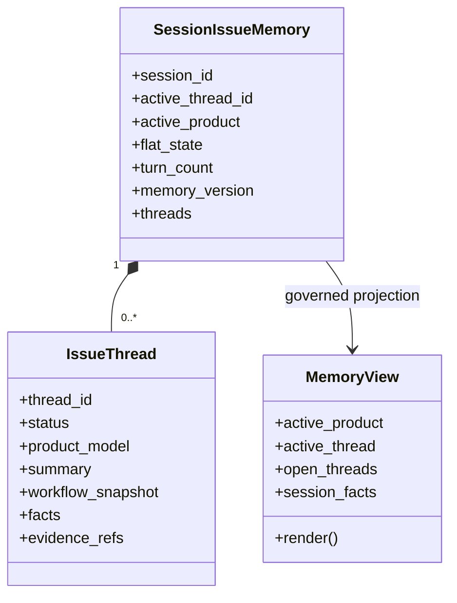
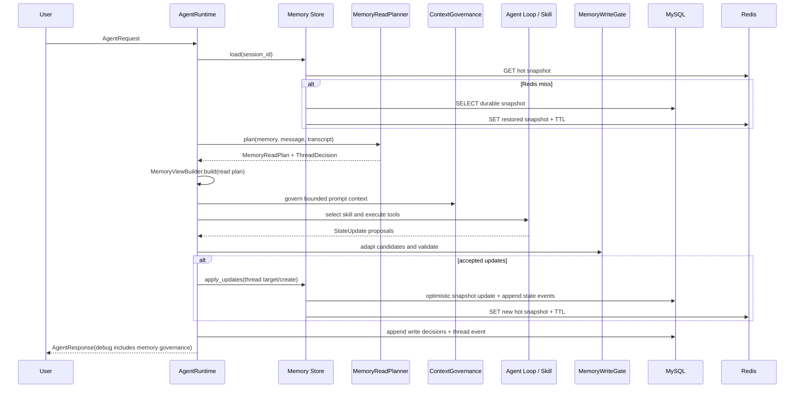
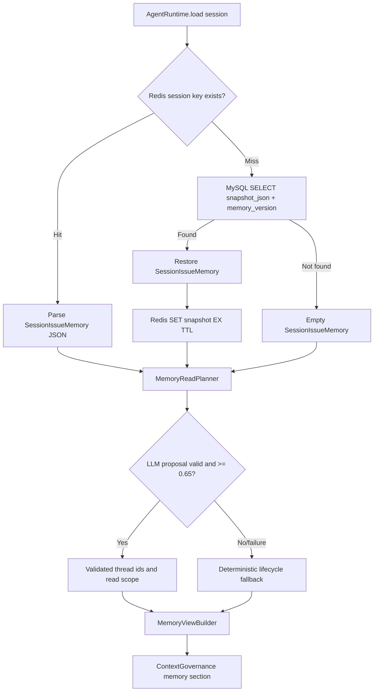
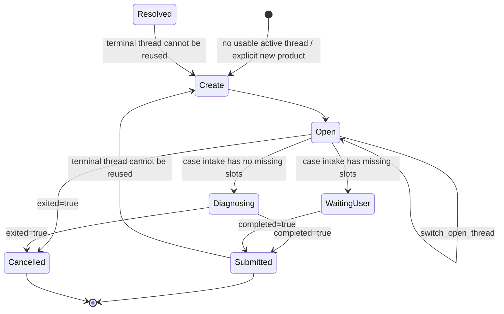
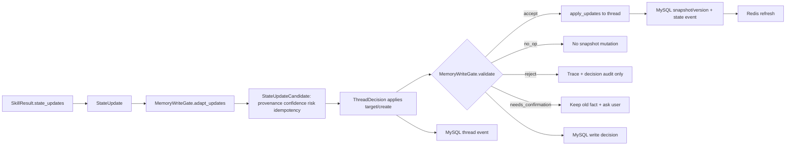

# nikon0 Memory Runtime Deep Dive

> Scope: source code, the production-like multi-turn rerun, and read-only MySQL/Redis sampling performed on 2026-06-20. Connection credentials, user data, and identifiers are redacted. This is an implementation document, not a target-state proposal.

## 1. Executive Summary

`nikon0` treats memory as a runtime-governed state system rather than a bag of chat history. The unit of persistence is `SessionIssueMemory`; its business unit is an `IssueThread`; and the model-facing projection is a bounded `MemoryView`.

The runtime owns the authority boundary:

```text
Skill proposes StateUpdate
Runtime turns it into StateUpdateCandidate
MemoryWriteGate decides accept/reject/needs_confirmation/no_op
Store persists accepted state to MySQL and refreshes Redis
Runtime records trace and audit events
```

The current production-like eval used `RedisMysqlSessionIssueStore` and real LLM context components. Read-only inspection found four live MySQL tables, 138 durable snapshots, 153 state-update events, 20 write-decision events, and 21 thread events. The latest ten multi-turn eval sessions (`eval-qa-126` through `eval-qa-135`, except `127`) all have a durable `turn_count=2` and `memory_version=2`.

The important caveat is equally real: `run_manual_qa_eval.py` writes `raw_results.jsonl` and `report.json`, but does **not** persist the full `response.debug.trace` for each item. For the rerun, memory evidence is therefore reconstructed from MySQL snapshot/audit data and the raw result's `trace_id`, not a report-local full trace file.

## 2. Why Memory Exists in nikon0

A customer conversation is not one global fact set. A customer can ask about an air conditioner, then an air fryer, then resume the air conditioner repair. The memory model separates:

| Concept | Meaning | Authority |
|---|---|---|
| `SessionIssueMemory` | One session's durable state container | MySQL snapshot, Redis hot copy |
| `IssueThread` | One product/issue/workflow thread | Stored inside session snapshot |
| `active_thread_id` | The thread selected for this turn | Lifecycle decision + store |
| `active_product` | Convenience projection of active thread product | Compatibility/read convenience, not independent truth |
| `flat_state` | Legacy Skill/workflow compatibility state | Compatibility layer, not the preferred fact authority |
| `MemoryView` | Small approved representation supplied to model context | Runtime-built, transient |

`SessionIssueMemory` includes tenant/user fields, active thread/product/skill, `threads`, `session_facts`, `turn_count`, `memory_version`, and `flat_state` ([`nikon0/app/schemas/memory.py`](../app/schemas/memory.py)). `IssueThread` holds status, product, goal, workflow snapshot, facts, evidence references, and turn IDs.

This solves three distinct problems:

1. Follow-up understanding: “刚才那个问题继续” needs a selected thread.
2. Durable workflow continuation: repair/refund collection needs missing slots and workflow status.
3. Governance: a generated answer must not silently overwrite an order number, address, product identity, or ticket fact.

## 3. Mental Model: Session / IssueThread / ActiveThread / MemoryView



`MemoryViewBuilder` reads only threads approved by `MemoryReadPlan`; it limits open threads, facts, and rendered size (defaults: 5 open threads, 8 facts, 1600 chars) ([`nikon0/memory/view.py:68-152`](../memory/view.py)). It intentionally avoids passing raw `flat_state` to the model-facing memory block. This prevents accidental broad exposure of legacy workflow data and limits irrelevant-thread leakage.

## 4. Runtime Integration Points

### One `AgentRuntime.run()` turn



Concrete cut points in [`nikon0/agent/runtime.py`](../agent/runtime.py):

1. Create trace and replay/append transcript: lines 82-98.
2. Load `SessionIssueMemory`: line 99.
3. Run `MemoryReadPlanner`; build `MemoryView`; emit `memory.read_plan` and `memory.thread_decision`: lines 100-115.
4. Attach model-facing `memory_context`, tools, trace, then call `ContextGovernance.agovern`: lines 116-126.
5. Run planner, bounded `AgentLoop`, selected Skill, and safety: lines 127-160.
6. Adapt `SkillResult.state_updates` to candidates; apply lifecycle target/create choice; validate with the write gate: lines 162-184.
7. Persist **only accepted** updates. A persistence failure blocks medium/high-risk work and only low-risk work gets explicit ephemeral degradation: lines 187-210.
8. A `needs_confirmation` decision replaces the answer with a clarification request; accepted updates go to trace, then SQL audit is appended: lines 211-228 and 329-338.
9. Return `debug.memory_governance` containing read plan, thread decision, write decisions, degradation flag, and store profile: lines 284-314.

`AgentLoop` is still a top-level bounded control loop. Product-support tool steps happen inside one Skill execution; no extra top-level turn is created for each retrieval/tool ([`nikon0/agent/loop.py:44-126`](../agent/loop.py)).

## 5. Read Path Deep Dive



### Storage read and restore

`RedisMysqlSessionIssueStore.load()` first reads `nikon0:memory:session:<session_id>`. On hit it parses the JSON snapshot. On miss it calls `SqlMemoryPersistence.load_snapshot()`, stores the recovered durable snapshot in Redis with TTL, and returns it. If neither exists it creates empty memory ([`nikon0/memory/persistence.py:273-285`](../memory/persistence.py)).

The dedicated SQL `memory_version` is injected over the serialized JSON version when loading. This is deliberate: the DB column is the concurrency authority ([`nikon0/memory/persistence.py:123-136`](../memory/persistence.py)).

### Read planning and LLM boundary

`MemoryReadPlanner` first gets a deterministic lifecycle fallback. When configured with an LLM client, it sends only current message, active thread ID, **open** thread summaries, and up to 1000 characters of recent transcript. The required response is strict JSON with action, existing open thread IDs to read, scope flags, confidence, and reason ([`nikon0/memory/governance/read_planner.py:19-75`](../memory/governance/read_planner.py)).

The runtime accepts an LLM thread decision only when:

- confidence is at least `0.65`;
- action is one of `continue_active`, `switch_open_thread`, `create_thread`, or `needs_clarification`;
- a continue/switch target is an existing non-terminal thread.

Invalid JSON, timeout, exception, low confidence, invalid ID, or invalid action falls back deterministically ([`nikon0/memory/governance/read_planner.py:77-104`](../memory/governance/read_planner.py)). In the default production builder, the LLM client is enabled only when configuration enables it and a model is present ([`nikon0/agent/runtime.py:409-429`](../agent/runtime.py)).

`MemoryViewBuilder` then exposes only planned thread IDs, active product/skill, selected thread facts, selected open-thread summaries, and explicitly allowed session facts. It does not render resolved/cancelled threads as open threads ([`nikon0/memory/view.py:76-138`](../memory/view.py)).

## 6. Active Thread Lifecycle



`IssueThreadLifecycleManager` uses explicit current-message product identity before an old session product. It creates a new thread when the explicit product differs from an active thread, switches to an existing matching open product thread only for reference-like language, and otherwise continues the active usable thread ([`nikon0/memory/governance/lifecycle.py:14-34`](../memory/governance/lifecycle.py)). Reference signals include “刚才”, “上次”, “继续”, “还是”, “那个”, and English equivalents (lines 37-39).

`active_product` is a convenience projection updated from product-support state; the active thread owns `product_model`, product reference, goal, facts, and workflow state ([`nikon0/memory/session.py:139-175`](../memory/session.py)).

For case intake, accepted updates set status as follows: `exited -> cancelled`, `completed -> submitted`, missing slots -> `waiting_user`, otherwise `diagnosing` ([`nikon0/memory/session.py:257-279`](../memory/session.py)). Product-support updates do not currently move a thread to `resolved`; they remain `open`. This is an intentional current-state fact, not a claimed closed-loop resolution mechanism.

### Verified examples

| Evidence | Observation |
|---|---|
| `eval-qa-126` | First turn created a thread; second turn continued the same Airfryer thread. MySQL: `turn_count=2`, `memory_version=2`, two accepted decisions, two state-update events. |
| `eval-qa-129` | The LLM chose `create_thread` for the first dishwasher leakage turn (`0.95`) and `continue_active` for the follow-up after replacing the door seal (`0.90`). Snapshot product is `dishwasher`; two accepted updates exist. |
| `eval-qa-132` | The LLM created then continued the air-conditioner thread; the second update retained product scope `空调手册/AC900手册`. |
| `memory-governance-real-threads` | Durable snapshot has two open threads: air fryer and air conditioner, with air fryer active. However its MySQL `thread_events`/`write_decisions` are empty because it was a store-level verification, not a full `AgentRuntime.run()` path. This is useful snapshot proof, but not a complete lifecycle-audit proof. |

## 7. Write Path Deep Dive



Skills produce legacy-compatible `StateUpdate(key, value, reason, evidence_ids, provenance, confidence)` ([`nikon0/app/schemas/capability.py:25-34`](../app/schemas/capability.py)). `ProductSupportSkill` emits product resolution, manual scope, evidence count, product identity, and last query in a `product_support` update; `CaseIntakeSkill` emits workflow state, missing slots, completion/cancellation, and ticket payload.

The runtime adapts each update to `StateUpdateCandidate`, assigning provenance (`workflow` for case intake, otherwise `skill`), default confidence (`0.92` or `0.82`), risk, a candidate ID, and a SHA-256-derived idempotency key ([`nikon0/memory/governance/write_gate.py:23-37`](../memory/governance/write_gate.py); contract at [`types.py:19-29`](../memory/governance/types.py)). The lifecycle choice supplies `target_thread_id` and `create_thread` before validation.

### Gate outcomes

| Outcome | Effect |
|---|---|
| `accept` | Runtime writes update to chosen/new thread; state event and snapshot are persisted. |
| `reject` | No snapshot update; trace records rejection; decision audit is still appended. |
| `needs_confirmation` | No candidate update is applied; current answer is replaced with a confirmation prompt; decision audit is appended. |
| `no_op` | No duplicate snapshot update; decision audit is appended. |

The gate rejects writes to terminal threads, invalid phone/order formats, and model-originated critical facts. It detects conflicts by flattened field path and source/confidence precedence. Critical hints currently include `product`, `model`, `order`, `phone`, `mobile`, `address`, `ticket`, and `case_id`, plus Chinese equivalents ([`nikon0/memory/governance/write_gate.py:46-157`](../memory/governance/write_gate.py)). Lower-trust values do not overwrite higher-trust stored facts; direct model provenance cannot write critical facts at all.

`flat_state` is updated only after an accepted store write. Workflow progress is stored under `case_intake` and its structured status is applied separately; it is not a user-fact conflict simply because `collecting` changes to `ready` ([`nikon0/memory/session.py:177-225`](../memory/session.py)).

### Verified decision examples

- **Accept:** `eval-qa-129` generated two `product_support` candidates; both are durable `accept` rows. Each has evidence IDs from Enterprise RAG and updates the same dishwasher thread.
- **Conflict:** `memory-governance-real-conflict` has stored `case_intake.order_id=ORD-*****` from `user` at confidence `0.95`. A `verified_tool` candidate for a different redacted order at `0.62` was recorded as `needs_confirmation`; snapshot remains at `memory_version=1` and keeps only the original order fact. This proves decision auditing is retained without applying rejected/confirmation state.

## 8. Redis and MySQL Data Model

### Responsibility boundary

```text
Redis = hot session snapshot/cache + cross-process session lock
MySQL = durable session snapshot + audit/event source of truth
```

### Redis

| Item | Current implementation / observed evidence |
|---|---|
| Session key | `nikon0:memory:session:<session_id>` ([`persistence.py:385-386`](../memory/persistence.py)) |
| Lock key | `nikon0:memory:lock:<session_id>` ([`persistence.py:345`](../memory/persistence.py)) |
| Value | Full JSON `SessionIssueMemory`, not a partial projection |
| TTL | Configured `86400` seconds; observed eval keys had approximately 84-85k seconds remaining during sampling |
| Read | Redis first, then MySQL restore on miss |
| Write | After successful SQL snapshot save, `SET key payload EX ttl` |
| Deletion | No explicit session-delete flow was found in `RedisMysqlSessionIssueStore`; normal expiry is TTL-driven. **Not found in current implementation:** a retention/purge policy. |
| Lock observation | No lock key was present at sampling time, which is expected after completed writes. |

Read-only Redis verification found 137 `nikon0:memory:*` keys. `eval-qa-131` was a string key with a complete snapshot shape containing `threads`, `flat_state`, `memory_version`, and `active_thread_id`; it had `turn_count=2`, `memory_version=2`, and one thread.

### MySQL

Read-only inspection used a local MySQL `nikon0` schema with credentials omitted. The four memory tables exist:

| Table | Role | Snapshot or append-only | Observed rows |
|---|---|---|---:|
| `nikon0_memory_sessions` | Durable full `SessionIssueMemory` snapshot and version | One mutable row per session | 138 |
| `nikon0_state_update_events` | Accepted legacy-compatible `StateUpdate` history | Append-only | 153 |
| `nikon0_memory_write_decisions` | Gate decision audit for all outcomes | Append-only | 20 |
| `nikon0_memory_thread_events` | Lifecycle action audit | Append-only | 21 |

#### `nikon0_memory_sessions`

Columns: `session_id` PK `varchar(191)`, `snapshot_json json`, `turn_count int`, `updated_at float`, `memory_version int`. It participates in restore and is the only snapshot table. `memory_version` increments from 1 on insert and by one on each accepted snapshot update ([`nikon0/memory/persistence.py:87-121`](../memory/persistence.py)).

Example, redacted: `eval-qa-129` has `turn_count=2`, `memory_version=2`, active dishwasher thread, and a JSON snapshot containing two accepted product-support turns.

#### `nikon0_state_update_events`

Columns: auto-increment `id` PK, indexed `session_id`, `turn_id`, `update_key`, `update_json`, `reason`, `evidence_ids_json`, `created_at`. This table is append-only and records accepted updates after snapshot persistence ([`nikon0/memory/persistence.py:182-233`](../memory/persistence.py)). It is useful for replay/debug but is not currently used by `load()` to reconstruct a snapshot.

#### `nikon0_memory_write_decisions`

Columns: auto-increment `id` PK, indexed `session_id`, `thread_id`, `turn_id`, `candidate_id`, `outcome`, `decision_json`, `created_at`. It records decision reason, conflict details, and accepted update payload where applicable ([`nikon0/memory/persistence.py:138-175`](../memory/persistence.py)). It correlates with state events by `session_id` and `turn_id`, but there is no database foreign key or explicit unique constraint enforcing that relationship.

#### `nikon0_memory_thread_events`

Columns: auto-increment `id` PK, indexed `session_id`, `thread_id`, `turn_id`, `action`, `event_json`, `created_at`. It records lifecycle decisions, even when no state update is applied ([`nikon0/memory/persistence.py:157-166`](../memory/persistence.py)). The initial `create_thread` event naturally has an empty `thread_id`: the lifecycle decision precedes actual thread ID generation in the store.

**Index fact:** Current schema has single-column indexes on `session_id` and, for decisions/events, `thread_id` and `turn_id`; there is no composite `(session_id, created_at)` or `(thread_id, created_at)` index. Those were requested in the design plan but are **Not found in current implementation**.

## 9. Concurrency and Consistency

`RedisMysqlSessionIssueStore.apply_updates()` serializes writes per session:

1. Acquire an in-process `threading.Lock` with a 5-second timeout.
2. Acquire Redis lock using `SET lock_key token NX EX 10`, retrying for up to 5 seconds.
3. Reload durable SQL snapshot while holding the lock; its SQL version is authoritative.
4. Apply update in memory.
5. Save SQL snapshot with expected version, then refresh Redis, then append state-update events.
6. Release Redis lock only if token matches, via Lua compare-and-delete; release local lock in `finally`.

This is implemented at [`nikon0/memory/persistence.py:287-374`](../memory/persistence.py). `SET NX` prevents two application replicas from writing the same session concurrently. The process-local lock is a fallback for test/minimal adapters that do not implement Redis NX; it does **not** provide cross-process safety by itself.

SQL uses optimistic version checking: the update predicates on the old `memory_version`; a mismatch raises `MemoryVersionConflict` ([`nikon0/memory/persistence.py:103-120`](../memory/persistence.py)). Reloading SQL inside the critical section avoids stale version reuse and duplicate first insert in normal Redis-available operation. The candidate idempotency key is carried in the candidate/audit record, but is **not currently enforced by a DB unique index or queried before write**. Therefore it provides audit identity, not fully enforced exactly-once semantics.

### Load-test evidence

The checked-in V1 report records a real store-only run of 40 independent sessions plus 10 concurrent writers to one shared session: 50 operations, `error_rate=0`, `shared_event_count=10/10`, p50 `72.76 ms`, p95 `130.04 ms`, p99 `144.37 ms`, and throughput `331.80 ops/sec` ([`docs/memory_governance_v1_report.md`](../../docs/memory_governance_v1_report.md)). It also documents that an earlier run exposed duplicate initial inserts/stale versions, which led to the current locking and SQL-authoritative versioning.

The report artifact directory `nikon0/eval/reports/memory-load/` was **not found during this inspection**, so these numbers are documented evidence, not independently replayed artifact output. End-to-end concurrent LLM/RAG load testing is also **Not found in current implementation**.

## 10. LLM Boundary

| LLM may recommend | Runtime/guard owns |
|---|---|
| Which open thread is relevant | Final thread ID validation |
| Whether to continue/switch/create | Terminal-thread policy |
| Minimum memory read scope | Field conflict decision |
| Context section selection/compaction | Memory writes and persistence |
| Product answer wording, grounded in evidence | Critical-fact authority and source precedence |

The separation matters because an LLM can be uncertain, malformed, or influenced by irrelevant text. It is allowed to recommend; it cannot directly mutate memory, overwrite a critical fact, bypass a terminal status, or execute storage writes. Planner failure has a deterministic fallback; context LLM planners also parse strict JSON and fall back to deterministic context plans ([`nikon0/context/read_planner.py:84-132`](../context/read_planner.py)).

## 11. Trace and Eval Verification

### What the multi-turn dataset exercises

`agent_qa_eval_multi_turn.jsonl` contains ten cases (`qa-126` to `qa-135`) with one explicit `prior_turns` message plus the evaluated follow-up. `run_manual_qa_eval.run_one()` executes each prior message with the same `session_id=eval-<case_id>`, then executes the final message ([`nikon0/eval/run_manual_qa_eval.py:17-68`](../eval/run_manual_qa_eval.py)). The rerun report says:

- profile: `production_like`;
- memory store: `RedisMysqlSessionIssueStore`;
- real LLM enabled; Enterprise RAG primary with structured fallback;
- 10/10 answers non-empty, zero runner errors;
- total time 778.9 seconds, 77.89 seconds/item.

“OK: 10” means runner completion/non-empty answer, **not** that each answer was semantically correct or that memory quality passed a dedicated score.

### Evidence available per layer

| Layer | Available in this rerun | What it proves |
|---|---|---|
| `raw_results.jsonl` | Answer, selected skill, actions, trace ID, prior-turn count, tool data | Real chain ran and prior turns were injected |
| `report.json` | Runtime profile/audit and aggregate execution statistics | Persistent production-like profile was selected |
| MySQL snapshot | threads, facts, active thread, version, turn count | Durable final session state |
| MySQL state events | accepted updates and evidence IDs | What was persisted |
| MySQL decision/thread events | gate result and lifecycle action | Write governance and thread choice |
| Full per-turn trace artifact | **Not found in the rerun report directory** | Cannot independently inspect all context sections/read-plan payloads from report alone |

The full default production runtime uses `JsonlTraceRecorder` at `nikon0/infra/runtime/traces.jsonl` ([`nikon0/agent/runtime.py:377-389`](../agent/runtime.py)); the eval profile constructs its own runtime and the manual QA runner does not export those debug traces. This is the trace/eval observability gap to close later.

### Three concrete walkthroughs

#### Case `qa-126`: same product follow-up

1. Prior text: air fryer does not heat. Runtime creates an Airfryer product-support thread.
2. Final text: “我的空气炸锅有问题”. Snapshot has `product_model=airfryer`, product-support facts, and `last_turn_count=2`.
3. MySQL decision rows: first `accept` has empty thread ID (thread not generated yet); second `accept` targets the created thread.
4. Thread events: `create_thread` then deterministic `continue_active`.
5. This is evidence that the session was actually reused, not two independent single-turn calls.

#### Case `qa-129`: LLM-assisted continuation

1. Prior text establishes dishwasher leakage.
2. First thread event is LLM `create_thread` (`0.95`); second is LLM `continue_active` (`0.90`) because the user says the replacement made leakage worse.
3. Snapshot remains on a dishwasher thread, with two accepted `product_support` events and Enterprise RAG evidence IDs scoped to `洗碗机手册`.
4. This demonstrates the LLM's role is selection recommendation; the durable result still passed the runtime gate.

#### Case `qa-132`: product-scoped retrieval plus continued thread

1. Prior turn establishes an air-conditioner cooling issue.
2. Second turn references prior filter cleaning and still insufficient cooling.
3. MySQL shows `create_thread` then `continue_active`; product scope remains `air_conditioner` with allowed manuals `空调手册` and `AC900手册`.
4. Raw result's tool action shows Enterprise RAG retrieval and grounding validation, while the snapshot proves the thread persisted across both turns.

### Existing memory eval support

`run_agent_eval.py` has a `_memory_audit` that extracts write outcomes, read-plan source, thread action, and degradation from `AgentResponse.debug.memory_governance` ([`nikon0/eval/run_agent_eval.py:608-616`](../eval/run_agent_eval.py)). The dataset `nikon0/eval/datasets/memory_governance_cases.jsonl` exists. A corresponding `nikon0/eval/reports/memory-governance/` artifact was **not found during this inspection**.

## 12. Known Limitations

1. **Manual QA trace persistence gap:** `run_manual_qa_eval` does not save full debug traces. It cannot independently report memory read misses, wrong-thread reads, context section omission, or per-turn LLM planner fallback without DB reconstruction.
2. **Critical-field matching is too broad:** MySQL sampled `needs_confirmation` decisions for `eval-qa-131`, `qa-134`, and `qa-135` on `product_support.product_resolution`. The critical check matches the word `product`, so a structured resolution object can be treated like an identity fact. This is a real observed false-positive class; it should be decomposed into leaf identity fields or excluded as metadata.
3. **`flat_state` remains live compatibility state:** Product resolver and case intake still read it in places. It is not yet fully eliminated as a routing/workflow dependency.
4. **No `MemoryExtractorLLM`:** Not found in current implementation. Facts are proposed by Skills/tools and gated by runtime; there is no separate model that extracts arbitrary long-term facts from transcript.
5. **Thread summaries are shallow:** Current summaries are deterministic labels/goal fields. LLM conversation compaction exists for prompt context, but durable thread summarization/versioned summary refresh is not found.
6. **Terminal lifecycle coverage is incomplete:** Code has `submitted/resolved/cancelled` guards, but product support does not automatically resolve a completed technical question, and the latest ten-case rerun did not demonstrate submitted/cancelled persistence.
7. **Audit relation is logical, not enforced:** decision/event tables have no foreign keys and no composite time indexes. Candidate idempotency keys are not DB-enforced.
8. **PII security is not enterprise complete:** Contact/address/order values are stored in JSON snapshots/events. Session/tenant fields exist, but field encryption, key rotation, RBAC, audit access policy, and redacted operator views are not found in current implementation.
9. **High-availability validation is partial:** Redis lock and SQL optimistic versioning exist and a store-only test passed. Multi-replica deployment, Redis failover, MySQL failover, replay/backfill tooling, and end-to-end LLM/RAG load artifacts are not yet demonstrated.
10. **Failure order nuance:** Snapshot write occurs before state-update event append. An event append failure after successful snapshot could leave recoverable state without a matching event; there is no transactional outbox or reconciliation job found.

## 13. Interview Talking Points

**Q: Why do you need active threads instead of one session object?**  
A: A session can contain multiple independent customer issues. `active_thread_id` gives each turn a scoped product/goal/workflow while preserving other open issues. It prevents a new air-fryer question from contaminating an air-conditioner repair thread.

**Q: What happens when the user suddenly changes products?**  
A: Lifecycle resolves explicit product identity from the current message before consulting old session state. A different product creates a new thread; a reference such as “刚才那个” can switch to an existing matching open thread.

**Q: Why use Redis and MySQL together?**  
A: Redis makes session reads fast and supplies a distributed session lock. MySQL is durable and owns the authoritative versioned snapshot plus audit events. Redis loss is recoverable from MySQL.

**Q: Why cannot the LLM write memory directly?**  
A: It may hallucinate, produce malformed JSON, or confuse threads. The LLM only recommends scope/thread choice; deterministic validation, conflict policy, and persistence remain runtime-owned.

**Q: How do you avoid overwriting an old order number?**  
A: The gate flattens fields, recognizes critical facts, compares provenance/confidence, returns `needs_confirmation`, leaves the snapshot unchanged, and stores the decision audit. The read-only conflict sample verifies this behavior.

**Q: How is concurrent write consistency handled?**  
A: Per-session local lock plus Redis `SET NX` serializes writers; inside that section the runtime reloads SQL, uses `memory_version` optimistic checking, then refreshes Redis only after durable save.

**Q: How do you prove memory actually worked?**  
A: Correlate raw-result `trace_id`/session ID with MySQL snapshot, state-update events, write decisions, and thread events. For `qa-129`, this shows create then continue actions, a stable dishwasher thread, and two accepted updates.

**Q: What if Redis is unavailable?**  
A: The implemented Redis/MySQL store does not include a runtime Redis-bypass branch; initialization failures fall back to in-memory store, and individual persistence failures are handled at `AgentRuntime` risk level. A robust production Redis-outage mode is still a gap to implement/test.

**Q: What if the LLM selects the wrong thread?**  
A: The runtime accepts only valid open IDs with confidence >= 0.65; otherwise it falls back to deterministic lifecycle rules. This reduces invalid selection, though semantic wrong-thread selection still needs dedicated eval metrics.

**Q: How is this different from an ordinary session store?**  
A: It has explicit issue threads, governed model-visible views, write candidates and decision audits, provenance/confidence conflict control, durable versioning, and traceable lifecycle events.

## 14. Appendix

### Key source locations

| Concern | Source |
|---|---|
| Runtime memory entry/read/write | `nikon0/agent/runtime.py:82-315` |
| Production store/planner builder | `nikon0/agent/runtime.py:377-429` |
| Memory contracts | `nikon0/app/schemas/memory.py:12-73`; `nikon0/memory/governance/types.py:13-67` |
| Store/model projection | `nikon0/memory/session.py:28-291`; `nikon0/memory/view.py:68-152` |
| Redis/MySQL store | `nikon0/memory/persistence.py:24-440` |
| Read planner/lifecycle/write gate | `nikon0/memory/governance/read_planner.py`; `lifecycle.py`; `write_gate.py` |
| Context packing | `nikon0/context/runtime.py:59-282`; `nikon0/context/read_planner.py:53-132` |
| Product/case Skill state proposals | `nikon0/skills/product_support.py:111-260`; `nikon0/skills/case_intake.py:190-248` |
| Eval runner and memory audit | `nikon0/eval/run_manual_qa_eval.py:17-240`; `nikon0/eval/run_agent_eval.py:608-616` |

### Read-only queries used

```sql
SHOW TABLES;
SHOW COLUMNS FROM nikon0_memory_sessions;
SHOW INDEX FROM nikon0_memory_write_decisions;

SELECT session_id, turn_count, memory_version, updated_at
FROM nikon0_memory_sessions
WHERE session_id LIKE 'eval-qa-%'
ORDER BY updated_at DESC;

SELECT session_id, thread_id, turn_id, outcome, decision_json
FROM nikon0_memory_write_decisions
WHERE session_id = :session_id
ORDER BY id;

SELECT session_id, thread_id, turn_id, action, event_json
FROM nikon0_memory_thread_events
WHERE session_id = :session_id
ORDER BY id;
```

Redis inspection was read-only: `PING`, `SCAN nikon0:memory:*`, `TYPE`, `TTL`, `GET`, and JSON shape inspection. No cache key, MySQL row, eval artifact, or production source file was changed during evidence collection.

### 3-5 minute interview script

“In nikon0, I designed memory as a governed runtime capability, not as raw chat history. A session contains multiple issue threads, and only one active thread is selected for a turn. That matters because enterprise support users frequently switch products or return to a previous issue.

At the start of every runtime turn, I load session memory from Redis first. Redis is only the hot snapshot and distributed lock layer. If it misses, I restore from MySQL, which is the durable source of truth. Then a MemoryReadPlanner chooses the minimum thread scope. An LLM can recommend a thread and read scope, but the runtime validates JSON, confidence, open-thread IDs, and terminal-state rules. The model receives a bounded MemoryView, not raw flat state.

After a Skill runs, it does not write storage directly. It emits StateUpdate proposals. The runtime converts them into candidates carrying provenance, confidence, risk, target thread, and idempotency identity. MemoryWriteGate decides whether to accept, reject, deduplicate, or require user confirmation. For example, a lower-confidence tool value cannot overwrite a user-confirmed order number. The old fact remains, and the conflict decision is auditable.

For consistency, writes use a per-session Redis SET NX lock plus SQL optimistic versioning. Inside the lock, the store reloads the SQL snapshot, applies the update, updates the durable versioned snapshot, refreshes Redis, and appends audit events. In a real 50-operation store load test, including ten concurrent writers to one session, all ten shared events were retained with zero errors.

I validate this through eval and storage evidence. In the production-like multi-turn rerun, sessions such as qa-129 created and then continued the same dishwasher thread; MySQL shows version two, two accepted updates, and lifecycle audit rows. The remaining work is mainly operational hardening: persist full eval traces, narrow an over-broad critical-field matcher, add PII encryption/RBAC, and run multi-replica plus end-to-end LLM/RAG load tests.”
