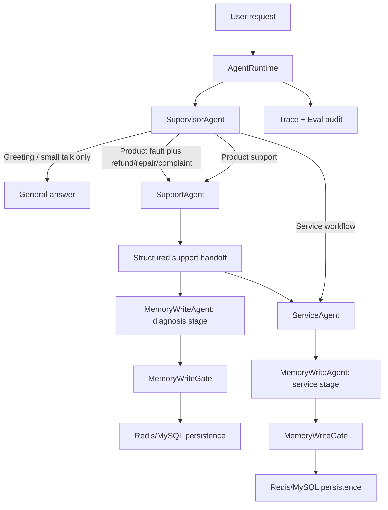
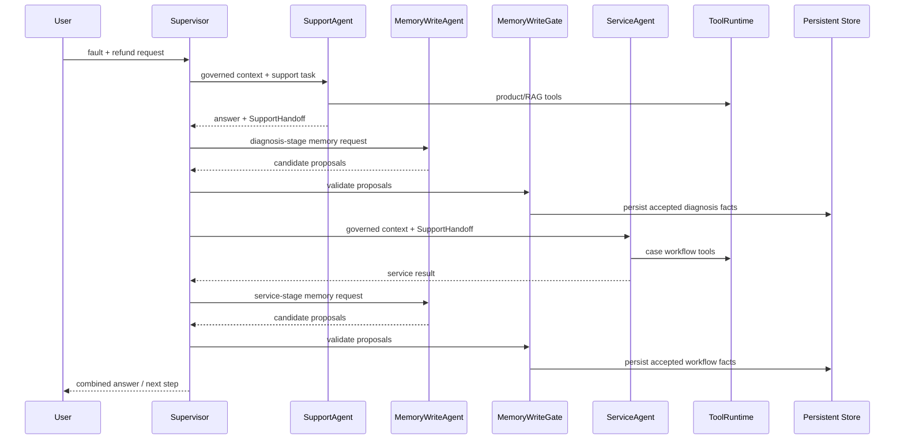

# nikon0 Multi-Agent V1 Design

## 1. Goal

Extend nikon0 from a single business orchestrator into a small, governed multi-agent runtime without replacing the existing Runtime, ToolRuntime, Memory Governance, Context Governance, Trace, or Eval foundations.

V1 introduces four explicit agents:

1. `SupervisorAgent`
2. `SupportAgent`
3. `ServiceAgent`
4. `MemoryWriteAgent`

The goal is not autonomous agent swarms. It is a deterministic, observable, sequential delegation model for the two existing business domains: product support and service intake.

## 2. Non-Goals

V1 does not implement:

- Unbounded agent-to-agent conversation.
- Parallel execution or voting among business agents.
- Direct agent access to Redis, MySQL, or raw session storage.
- Direct agent bypass of ToolRuntime, PermissionManager, SafetyGate, or MemoryWriteGate.
- Converting every Skill into an Agent.
- A new business domain beyond product support and service intake.
- Automatic task decomposition beyond the supported `Support -> Service` chain.

## 3. Core Principle

```text
Agent = a bounded decision/execution role.
Skill = a business capability package used by an Agent.
Tool = an atomic observable action.
Runtime = the authority for context, tools, policy, trace, and persistence.
```

The runtime remains the trust boundary. Agents can reason, delegate, call allowed tools, and propose results. They cannot independently persist memory or override policy.

## 4. Target Topology



The normal execution model is sequential. On a composite request, Support completes first, its governed result becomes an explicit handoff package, the diagnosis-stage memory commit point runs if triggered, then Service proceeds.

## 5. Agent Responsibilities

### 5.1 SupervisorAgent

SupervisorAgent is the top-level coordinator. It does not own domain-specific retrieval or workflow rules.

Responsibilities:

- Classify a request as greeting/small talk, support, service, or composite `support_then_service`.
- Select and sequence the business agent(s).
- Enforce a bounded delegation plan: V1 permits zero, one, or two business agents in a fixed order.
- Pass only governed context, approved memory view, allowed tool specs, and structured handoff data.
- Decide stop, clarify, handoff, and final response composition.
- Trigger `MemoryWriteAgent` at supported commit points.

SupervisorAgent may answer directly only when all conditions hold:

- Request is low-risk greeting, small talk, capability question, or thanks.
- No product/support/service workflow intent exists.
- No tool action, memory write, approval, or handoff is required.

It must not use the generic answer path for unsupported business intent. Business uncertainty must route to a specialist, clarification, or handoff.

### 5.2 SupportAgent

SupportAgent owns product manual support and diagnostic reasoning.

Responsibilities:

- Select and call allowed product tools through the shared ToolRuntime.
- Resolve product identity, retrieve manuals, use grounded evidence, and validate final answer grounding.
- Return a user answer plus a structured diagnostic handoff package.
- Expose uncertainty rather than inventing a diagnosis.

Allowed tools in V1:

```text
product-support.resolve_product
product-support.search_product_manual
product-support.validate_answer_grounding
```

SupportAgent does not call service MCP tools and does not write memory directly.

### 5.3 ServiceAgent

ServiceAgent owns high-constraint workflows such as repair intake, refund, complaint, and handoff.

Responsibilities:

- Read the governed support handoff package when present.
- Run workflow protocol and allowed case-intake tools through shared ToolRuntime.
- Collect only required slots and produce a structured service result.
- Request approval or handoff when workflow/policy requires it.

Support evidence is an input to service quality, not a precondition for service. If product identity or RAG evidence is insufficient, ServiceAgent must still proceed with collection and label the handoff package:

```text
diagnosis_status = insufficient_evidence
product_resolution = unresolved
```

ServiceAgent does not claim a confirmed defect from an uncertain diagnosis.

### 5.4 MemoryWriteAgent

MemoryWriteAgent is a proposal agent, not a storage agent.

Responsibilities:

- Use an LLM to identify durable facts, workflow facts, stable issue summaries, evidence references, and target thread candidates.
- Return strictly structured `StateUpdateCandidate` proposals with field-level provenance/confidence/reason/evidence references.
- Run only when Runtime detects a memory-write trigger.

It must not:

- Call Redis/MySQL.
- Directly mutate `SessionIssueMemory` or `flat_state`.
- Decide conflict outcome.
- Override target-thread validation or terminal thread policy.
- Treat unverified model inference as a key fact.

Every proposal still passes `MemoryWriteGate`, then the existing persistent store.

## 6. Execution Flows

### 6.1 Ordinary product support

```text
Supervisor -> Support
Support -> product tools -> grounded answer
Support completion -> optional MemoryWriteAgent
MemoryWriteAgent -> Gate -> Store
Supervisor -> final answer
```

The support-stage memory write is low risk. If the write agent fails, returns invalid JSON, or is below confidence threshold, the completed support answer remains valid, but the runtime does not persist LLM-derived facts.

### 6.2 Ordinary service workflow

```text
Supervisor -> Service
Service -> workflow/MCP tools -> workflow result
Service completion -> MemoryWriteAgent
MemoryWriteAgent -> Gate -> Store
Supervisor -> response, approval, or handoff
```

For high-risk service actions, a memory-write-agent failure is fail-closed: workflow advancement is blocked and the runtime creates an auditable handoff.

### 6.3 Composite support then service

Example request:

```text
"洗碗机漏水，换了门封条还是漏，我要退款。"
```



The support stage must complete before ServiceAgent starts. ServiceAgent consumes the structured handoff package, not SupportAgent's raw prompt, hidden chain-of-thought, or unvalidated draft memory.

## 7. Structured Handoff Contract

V1 introduces a typed, runtime-owned `SupportHandoff` contract. It is held in the execution context and trace/tool observation layer, not free-form agent chat.

```json
{
  "stage": "diagnosis",
  "product_resolution": {
    "status": "resolved | unresolved | disambiguation_required",
    "product_id": "string | null",
    "manual_names": ["string"]
  },
  "diagnosis_status": "grounded | insufficient_evidence | needs_clarification",
  "symptoms": ["string"],
  "attempted_steps": ["string"],
  "recommended_next_steps": ["string"],
  "safety_risks": ["string"],
  "evidence_ids": ["string"],
  "summary": "short, user-visible-safe summary"
}
```

Rules:

- `evidence_ids` must reference real ToolRuntime/KnowledgeRuntime outputs.
- `diagnosis_status=grounded` requires evidence.
- `insufficient_evidence` is valid and must not block ServiceAgent.
- ServiceAgent may cite the handoff but cannot convert it into an approved refund/repair conclusion without its own workflow/policy evaluation.

## 8. Memory Commit Points and Triggers

MemoryWriteAgent is not invoked on every turn. Runtime can trigger it in two ways.

### 8.1 Event trigger

Invoke after SupportAgent or ServiceAgent completes when one or more occur:

- New tool evidence or grounded diagnostic result exists.
- Workflow status, missing slots, approval state, or handoff state changed.
- User explicitly supplied a product model, order ID, phone, address, fault code, or other candidate fact.
- Lifecycle created/switched/closed a thread.
- A conflict requires user confirmation.

### 8.2 Periodic consolidation trigger

Invoke after the active thread crosses a configured meaningful-turn threshold, proposed V1 default `4` turns. It may propose an issue-local summary, stable facts, unresolved items, and next step; it does not scan unrelated session threads.

### 8.3 Two commit points in a composite flow

| Commit point | Source Agent | Allowed intended content | Risk behavior |
|---|---|---|---|
| Diagnosis commit | SupportAgent completion | product identity, symptom, attempted steps, evidence references, uncertainty | Low-risk failure: do not write LLM inference; preserve response |
| Service commit | ServiceAgent completion | workflow status, missing slots, user-confirmed key facts, ticket reference | High-risk failure: stop workflow advance and hand off |

Each candidate carries `source_agent` and `execution_stage` in its provenance/audit payload. Existing `target_thread_id`, confidence, risk, and idempotency data remain mandatory.

## 9. MemoryWriteAgent Contract and Safety

### Input

Only governed data is supplied:

- Current request.
- Selected `MemoryView`.
- Current `ThreadDecision`.
- Structured business-agent result/handoff.
- Approved tool observations and evidence references.
- Stage policy and allowed field schema.

Raw database snapshots, unrelated thread facts, secrets, and unconstrained transcript history are not inputs.

### Output

The LLM must return JSON only:

```json
{
  "candidates": [
    {
      "update_key": "product_support | case_intake",
      "fields": {"key": "value"},
      "target_thread_id": "existing id or null",
      "scope": "thread",
      "confidence": 0.0,
      "reason": "short factual reason",
      "evidence_ids": ["existing evidence id"],
      "source_agent": "support | service",
      "execution_stage": "diagnosis | service_workflow"
    }
  ]
}
```

Runtime validates JSON shape, field allowlist, evidence references, target thread, confidence, and stage. It converts valid output to existing `StateUpdateCandidate` objects. `MemoryWriteGate` remains the final authority for `accept`, `reject`, `needs_confirmation`, and `no_op`.

### Failure policy

| Situation | Support stage | High-risk service stage |
|---|---|---|
| Timeout / invalid JSON / low confidence | Do not persist model-derived candidates; preserve answer and trace failure | Block workflow progression; create handoff; trace failure |
| Gate reject | Do not persist rejected candidate | Do not persist; handoff if required fact blocks workflow |
| Gate needs confirmation | Ask user and pause dependent fact use | Ask user or handoff; no irreversible service action |
| Store persistence failure | Existing low-risk degraded-memory policy | Existing high-risk persistence block and handoff |

## 10. Tool and Context Boundaries

V1 uses the direct-tool model:

```text
Business Agent -> shared ToolRuntime -> Tool result in context.trace/context.tool_results
```

SupportAgent and ServiceAgent can directly execute only their own `allowed_tools`. ToolRuntime continues to perform registry lookup, permission checks, policy checks, result normalization, trace recording, and observation management.

MemoryWriteAgent has no persistence tools. Its only output is a typed proposal returned to Runtime. Runtime owns memory load, read planning, view construction, write gate, audit persistence, and Redis/MySQL refresh.

## 11. Runtime Changes at a Design Level

The existing `AgentRuntime` should be extended, not replaced.

1. Add a typed delegation plan to Supervisor result: `general`, `support`, `service`, or `support_then_service`.
2. Add agent-specific manifests: capabilities, allowed tools, risk, handoff input/output contracts.
3. Replace the current single selected Skill execution with a bounded sequential executor:
   - maximum two business agents in V1;
   - fixed composite order: support then service;
   - no parallel branches.
4. Store structured handoff in `AgentContext`/trace as an approved runtime artifact.
5. Add `MemoryWriteRequest` trigger evaluation after each business-agent completion.
6. Call MemoryWriteAgent only when triggered; validate and route its output through the existing gate/store path.
7. Preserve legacy Skill execution behind a feature flag during migration.

## 12. Trace and Eval Requirements

Every execution must record:

```text
agent.delegation_plan
agent.start / agent.stop
agent.handoff_created / agent.handoff_consumed
memory_write.triggered / skipped
memory_write_agent.request / response / validation_failure
memory.write_validate
memory.persistence.blocked / degraded
```

Required evaluation metrics:

- `delegation_accuracy`
- `composite_order_accuracy`
- `unsupported_business_general_answer_rate`
- `support_to_service_handoff_completeness`
- `memory_write_trigger_precision`
- `memory_write_agent_valid_json_rate`
- `memory_write_agent_gate_accept_rate`
- `memory_write_agent_hallucinated_fact_reject_rate`
- `high_risk_memory_write_block_rate`
- `wrong_thread_write_rate`
- `stage_specific_memory_persistence_rate`

Minimum V1 cases:

1. Greeting stays in Supervisor general response.
2. Product question goes only to SupportAgent.
3. Repair/refund workflow goes only to ServiceAgent when no diagnosis is needed.
4. Fault plus refund executes Support then Service in order.
5. Support has no RAG evidence but Service still collects workflow slots.
6. Support-stage write-agent invalid JSON does not block low-risk answer.
7. Service-stage write-agent invalid JSON blocks high-risk workflow and hands off.
8. A conflicting order/contact fact is rejected or requires confirmation.
9. MemoryWriteAgent never calls persistence tools.
10. Trace contains both stage commit points for a composite request.

## 13. Migration and Rollback

Migration is feature-flagged:

```text
NIKON0_MULTI_AGENT_ENABLED=false  # default during rollout
NIKON0_MEMORY_WRITE_AGENT_ENABLED=false
```

With multi-agent disabled, current `SupervisorAgent -> Skill` behavior remains unchanged. With MemoryWriteAgent disabled, existing Skill `StateUpdate` compatibility path remains available and still goes through `MemoryWriteGate`.

Rollout order:

1. Introduce contracts and trace only, shadow delegation decisions.
2. Enable SupportAgent as a wrapper around current ProductSupportSkill.
3. Enable ServiceAgent as a wrapper around current CaseIntakeSkill/workflow.
4. Enable composite sequential execution for a small eval suite.
5. Enable MemoryWriteAgent in shadow mode; compare candidates with legacy updates.
6. Enable low-risk diagnosis commit.
7. Enable high-risk service commit only after failure-block and persistence evals pass.

## 14. Acceptance Criteria

V1 is complete when:

- All four agent roles have typed contracts and explicit allowed tools.
- Supervisor direct answers are restricted to greeting/small-talk/capability queries.
- A composite fault-plus-service request runs Support then Service, never in reverse.
- Service continues with `insufficient_evidence` rather than rejecting a user because RAG failed.
- MemoryWriteAgent cannot persist memory directly.
- Every memory write proposal is reviewed by existing MemoryWriteGate.
- Low-risk Support memory-write failure does not invalidate a completed grounded answer.
- High-risk Service memory-write failure blocks workflow advancement and creates handoff.
- Eval reports agent delegation, handoff, memory-write trigger, gate outcome, thread target, and stage.
- Existing single-agent/Skill behavior remains available through rollout flags.

## 15. Open Implementation Decisions

These are intentionally deferred until the implementation plan:

- Exact class/module layout versus adapting existing `SupervisorAgent` and Skills.
- Field allowlist for each `MemoryWriteAgent` stage.
- Threshold tuning for periodic consolidation; V1 proposal is four meaningful active-thread turns.
- Exact LLM prompt wording and schema-enforced response parser.
- Whether a stable `SupportHandoff` is stored only in trace/context or additionally persisted as a thread event.
- How production-like manual QA runner should persist full per-turn traces for multi-agent eval replay.
